# 3.5-Months-of-Bertelsmann-Scholarship-Cloud-Track
3.5-Months-of-Bertelsmann-Scholarship-Cloud-Track

# Day 1: Thursday, December 3, 2020.
- I registered to the Slack channel: https://bertelsmanncloudtrack.slack.com/
- I entered the classroom at: https://classroom.udacity.com/nanodegrees/nd081-1/dashboard/overview
- I watched some video lectures.

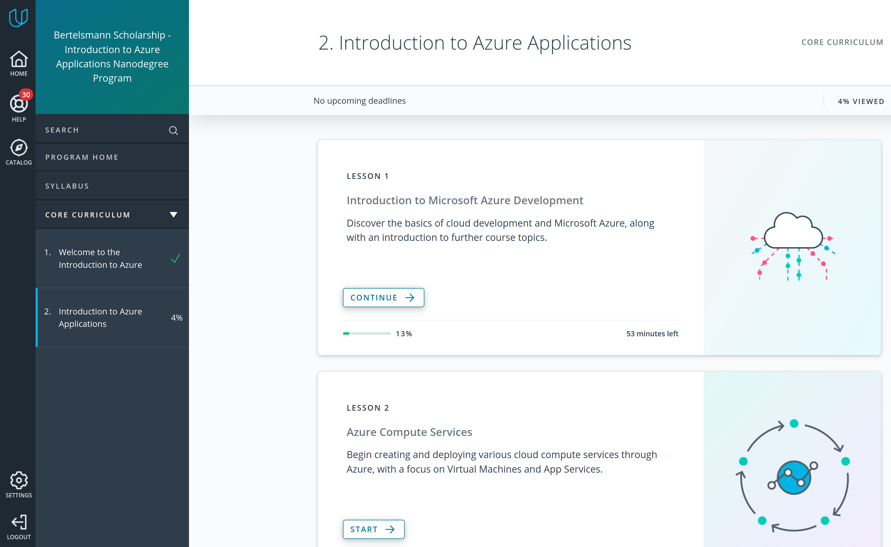
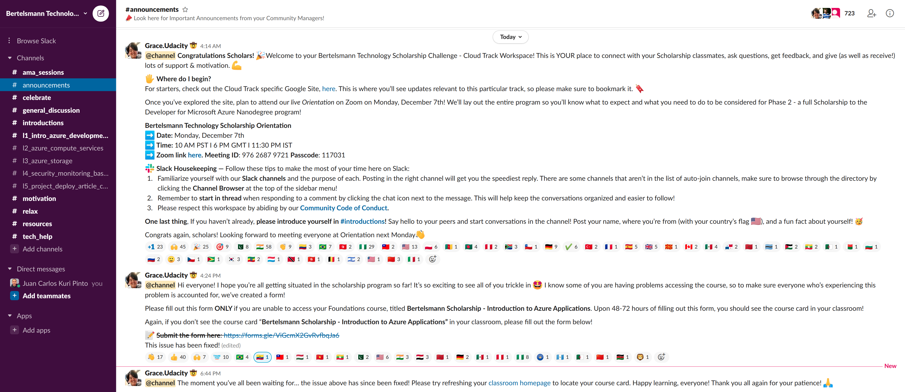

# Day 2: Friday, December 4, 2020.
- I read the official website of this scholarship: https://sites.google.com/udacity.com/bertelsmann-tech-scholarship
- I went to the Slack channel #introductions and I introduced myself.
- I watched some video lectures.

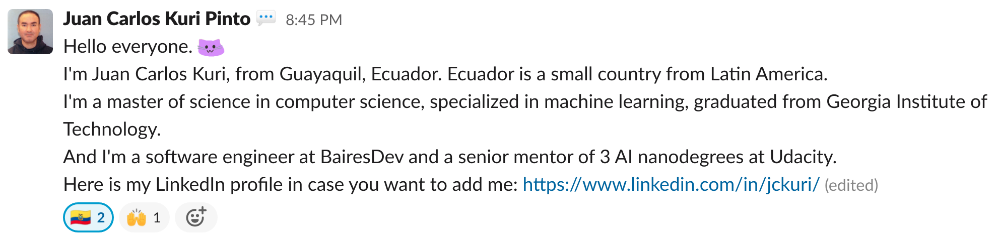

# Day 3: Saturday, December 5, 2020.
- I watched some video lectures. My current progress is "Lesson 1 - Introduction to Microsoft Azure Development" (38%)

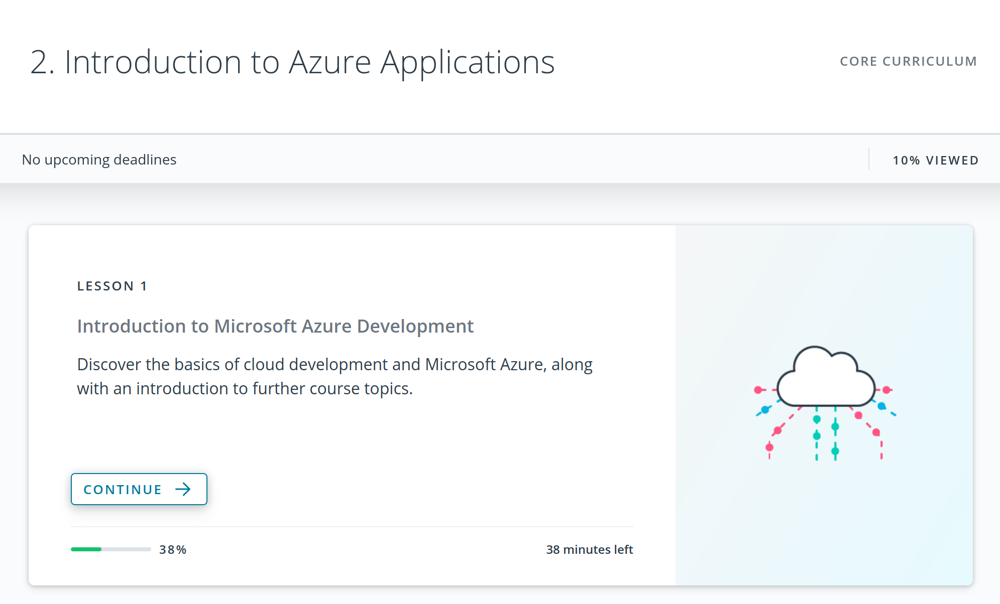

# Day 4: Sunday, December 6, 2020.
- I watched some video lectures. 
- My current progress is "Lesson 1 - Introduction to Microsoft Azure Development" (63%) - "10. The Azure Portal".

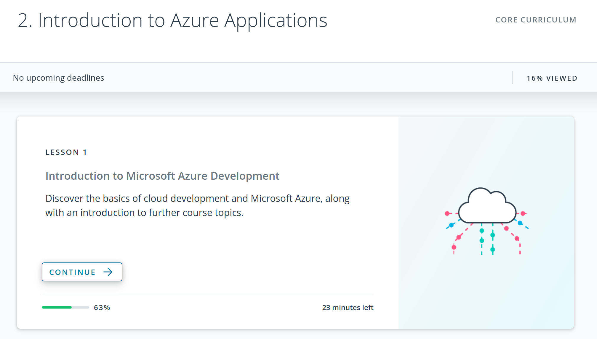

# Day 5: Monday, December 7, 2020.
- I tried to enter the Phase 1 Orientation but I couldn't: "This meeting has reached a maximum of 1000 participants. Please try again later."
- I watched the recording of the Phase 1 Orientation.

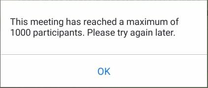
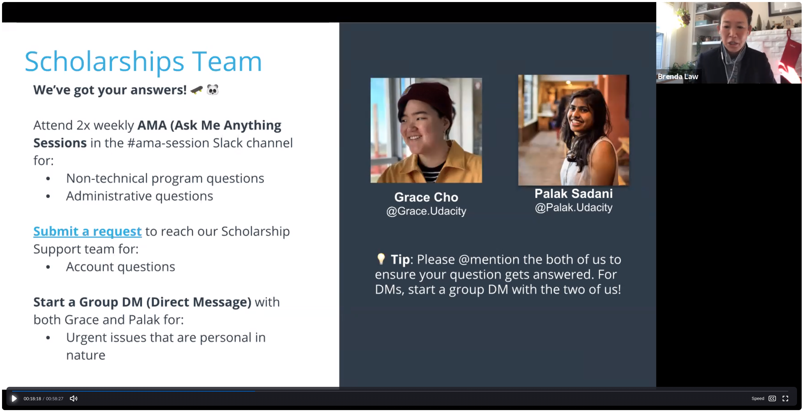

# Day 6: Tuesday, December 8, 2020.
- I watched some video lectures. 
- My current progress is "Lesson 1 - Introduction to Microsoft Azure Development" (69%) - "11. IaaS, PaaS, and SaaS".

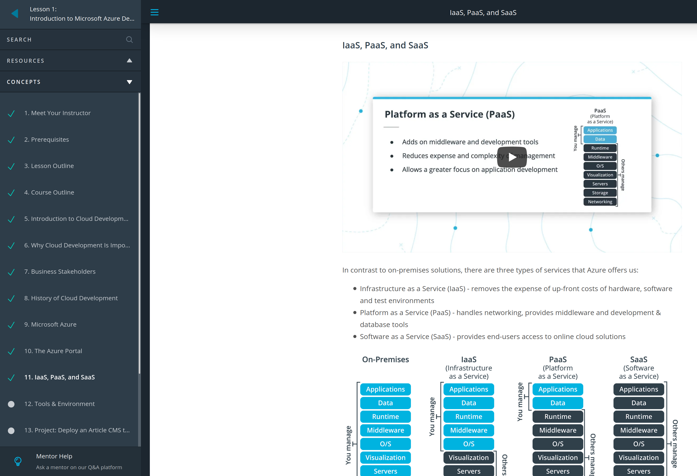

# Day 7: Wednesday, December 9, 2020.
- I watched some video lectures. 
- My current progress is "Lesson 1 - Introduction to Microsoft Azure Development" (75%) - "12. Tools & Environment".

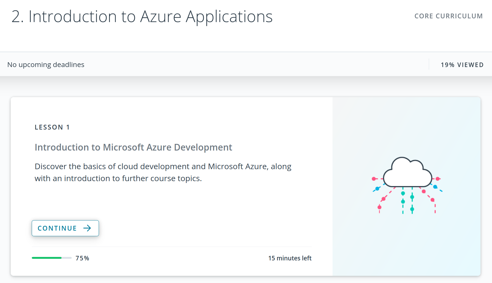

# D8: Thursday, December 10, 2020.
- I submitted the "Cloud Track #60DaysofUdacity Challenge - Pledge Form".
- I watched some video lectures.
- My current progress is "Lesson 2 - Azure Compute Services" (6%) - "1. Introduction".
- I encourage @Mateusz Zatylny, @Ana Peçini, @rachael bryce to continue in the #60DaysofUdacity challenge.

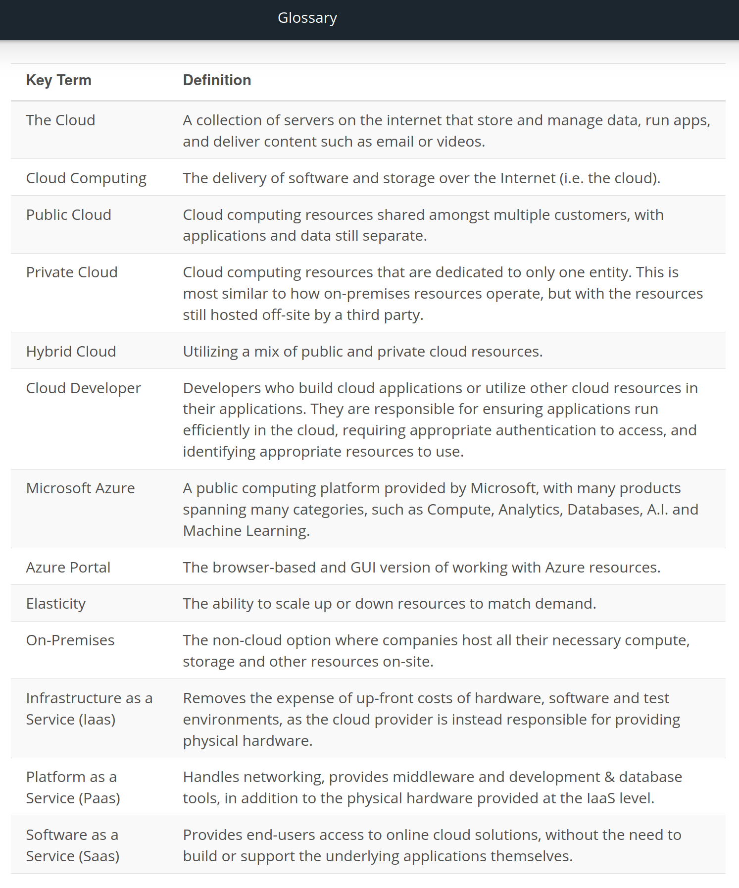
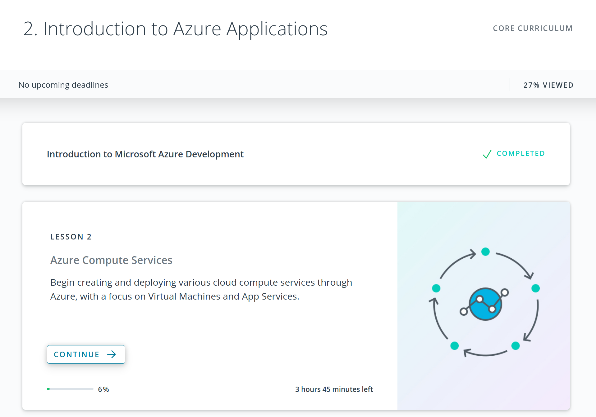

# D9: Friday, December 11, 2020.
- I watched some video lectures.
- My current progress is "Lesson 2 - Azure Compute Services" (25%) - "4. Exercise: Create A Resource Group".
- I encourage @Mateusz Zatylny, @Ana Peçini, @rachael bryce, @Laura_in_VA, @Ankit Biswas, @Kaustubha Shravan, @PK, @tapti sippy, @Alberto Pardo, @Anurag Shukla, @Carlota Pearl, @John V to continue in the #60DaysofUdacity challenge.

# D10: Saturday, December 12, 2020.
- I watched some video lectures.
- My current progress is "Lesson 2 - Azure Compute Services" (38%) - "6. Virtual Machines vs. App Services".
- I encourage @Mateusz Zatylny, @Ana Peçini, @rachael bryce, @Laura_in_VA, @Ankit Biswas, @Kaustubha Shravan, @PK, @tapti sippy, @Alberto Pardo, @Anurag Shukla, @Carlota Pearl, @John V, @priyanka hiranandani, @sreenidhi iyengar, @Skovski, @Peter to continue in the #60DaysofUdacity challenge.

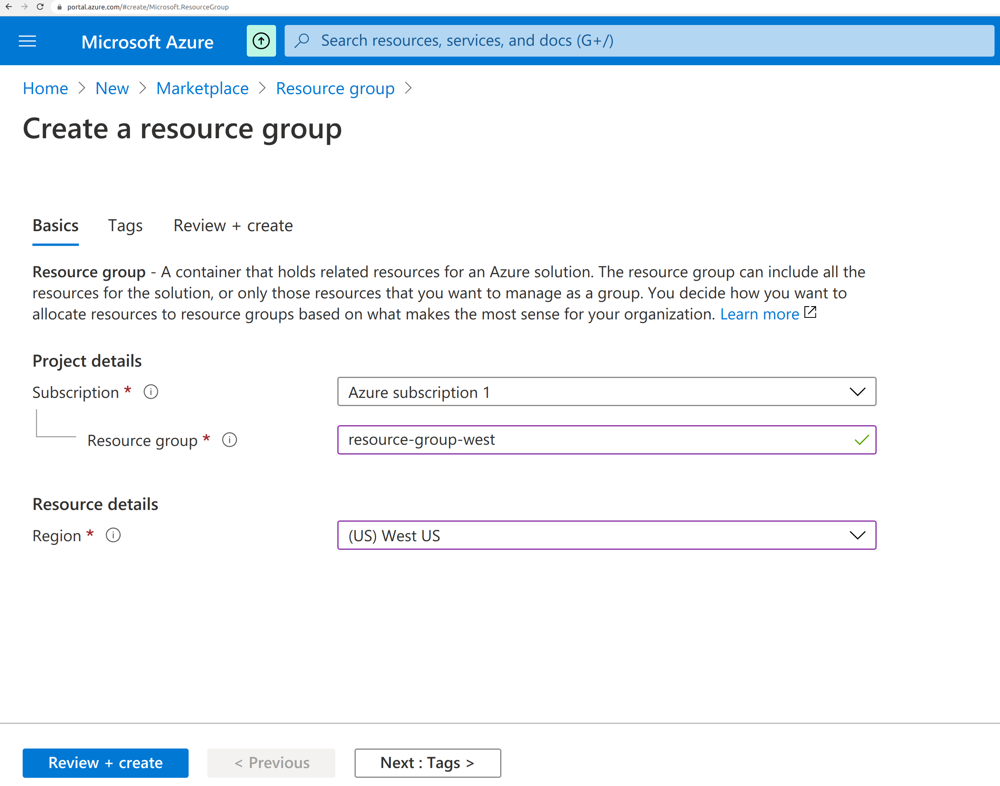
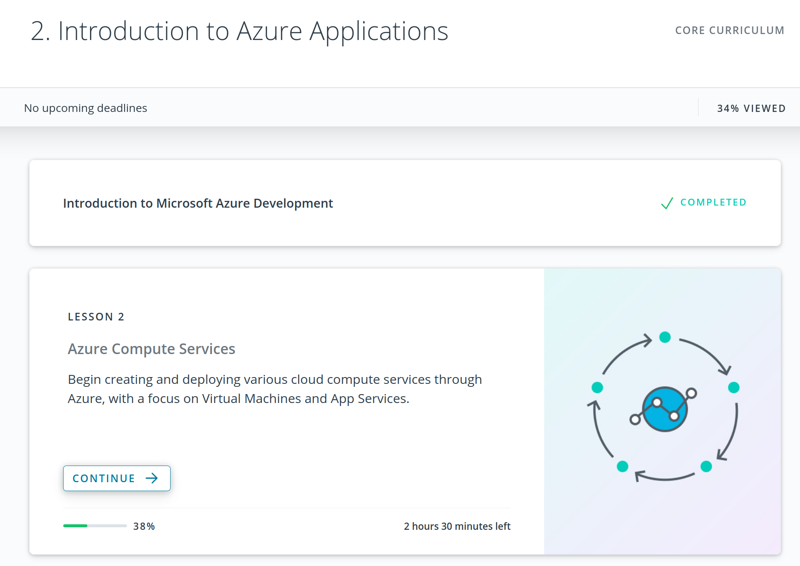

# D11: Sunday, December 13, 2020.
- I watched some video lectures.
- My current progress is "Lesson 2 - Azure Compute Services" (50%) - "8. Solution: Virtual Machines vs. App Services".
- I encourage @Mateusz Zatylny, @Ana Peçini, @rachael bryce, @Laura_in_VA, @Ankit Biswas, @Kaustubha Shravan, @PK, @tapti sippy, @Alberto Pardo, @Anurag Shukla, @Carlota Pearl, @John V, @priyanka hiranandani, @sreenidhi iyengar, @Skovski, @Peter to continue in the #60DaysofUdacity challenge.

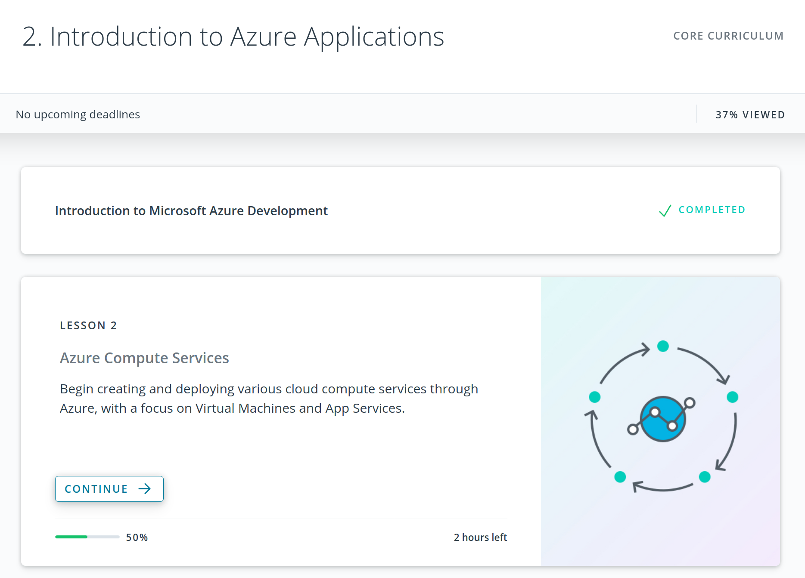

# D12: Monday, December 14, 2020.
- I watched some video lectures.
- My current progress is "Lesson 2 - Azure Compute Services" (63%) - "10. Exercise: Creating a Virtual Machine".
- I encourage @Mateusz Zatylny, @Ana Peçini, @rachael bryce, @Laura_in_VA, @Ankit Biswas, @Kaustubha Shravan, @PK, @tapti sippy, @Alberto Pardo, @Anurag Shukla, @Carlota Pearl, @John V, @priyanka hiranandani, @sreenidhi iyengar, @Skovski, @Peter to continue in the #60DaysofUdacity challenge.

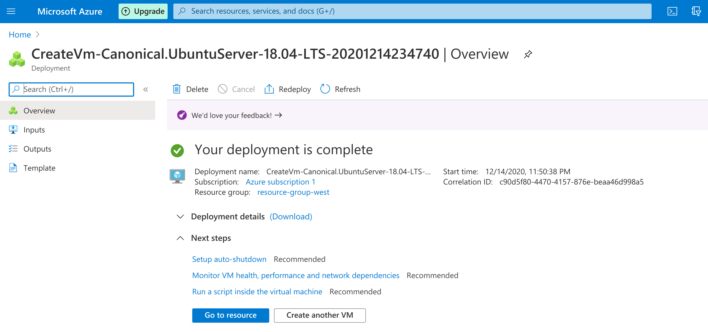
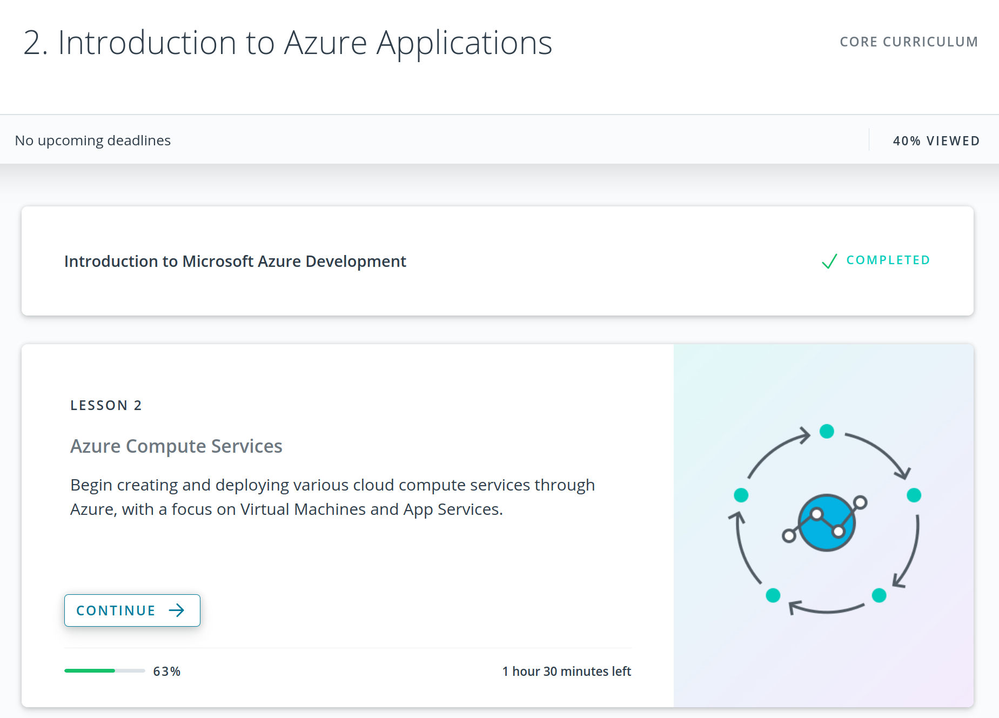

# D13: Tuesday, December 15, 2020.
- I watched some video lectures.
- My current progress is "Lesson 2 - Azure Compute Services" (75%) - "12. Creating an App Service".
- I encourage @Mateusz Zatylny, @Ana Peçini, @rachael bryce, @Laura_in_VA, @Ankit Biswas, @Kaustubha Shravan, @PK, @tapti sippy, @Alberto Pardo, @Anurag Shukla, @Carlota Pearl, @John V, @priyanka hiranandani, @sreenidhi iyengar, @Skovski, @Peter to continue in the #60DaysofUdacity challenge.

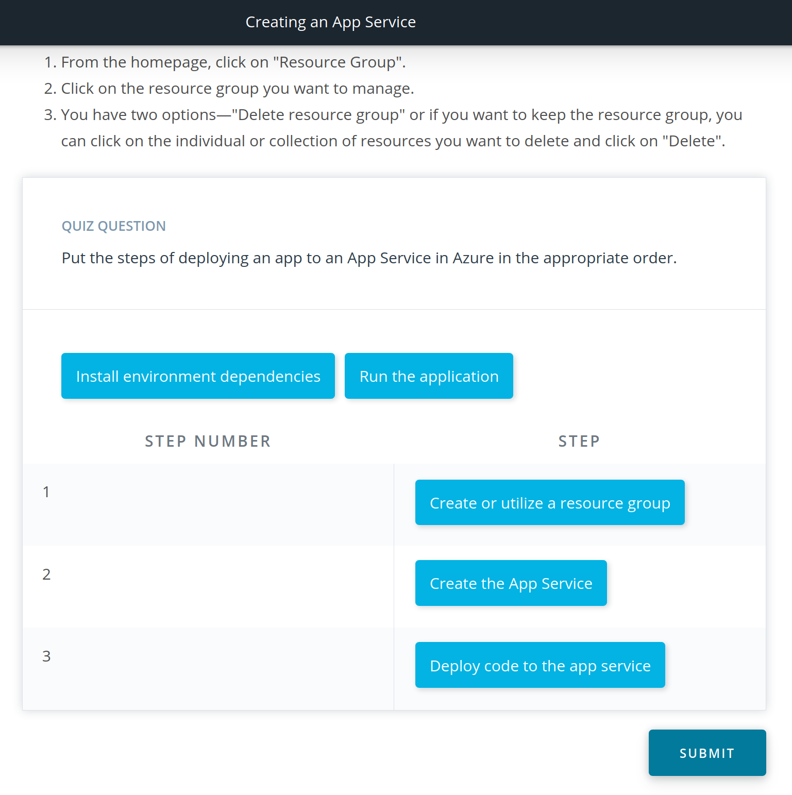

# D14: Wednesday, December 16, 2020.
- I created an App Service.
- My current progress is "Lesson 2 - Azure Compute Services" (75%) - "13. Exercise: Creating an App Service".
- I encourage @Mateusz Zatylny, @Ana Peçini, @rachael bryce, @Laura_in_VA, @Ankit Biswas, @Kaustubha Shravan, @PK, @tapti sippy, @Alberto Pardo, @Anurag Shukla, @Carlota Pearl, @John V, @priyanka hiranandani, @sreenidhi iyengar, @Skovski, @Peter to continue in the #60DaysofUdacity challenge.

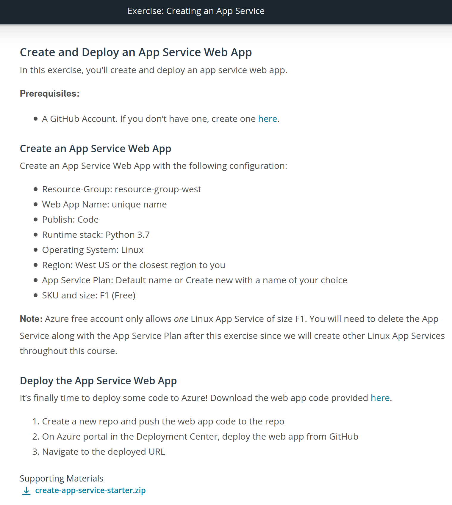

# D15: Thursday, December 17, 2020.
- I finished all the lectures of "Lesson 2 - Azure Compute Services".
- My current progress is "Lesson 2 - Azure Compute Services" (100%) - "16. Glossary".
- I encourage @Mateusz Zatylny, @Ana Peçini, @rachael bryce, @Laura_in_VA, @Ankit Biswas, @Kaustubha Shravan, @PK, @tapti sippy, @Alberto Pardo, @Anurag Shukla, @Carlota Pearl, @John V, @priyanka hiranandani, @sreenidhi iyengar, @Skovski, @Peter to continue in the #60DaysofUdacity challenge.

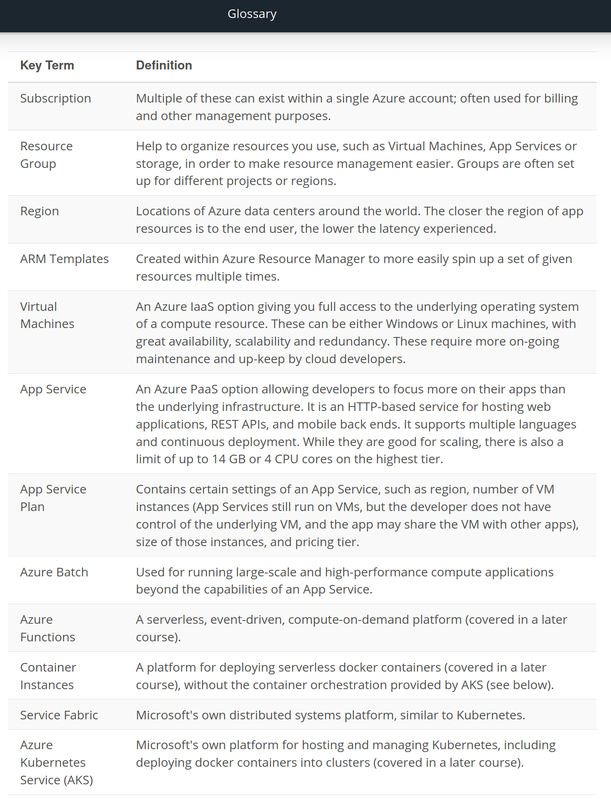

# D16: Friday, December 18, 2020.
- I watched some video lectures.
- My current progress is "Lesson 3 - Azure Storage" (14%) - "2. Big Picture: Storage".
- I encourage @Mateusz Zatylny, @Ana Peçini, @rachael bryce, @Laura_in_VA, @Ankit Biswas, @Kaustubha Shravan, @PK, @tapti sippy, @Alberto Pardo, @Anurag Shukla, @Carlota Pearl, @John V, @priyanka hiranandani, @sreenidhi iyengar, @Skovski, @Peter to continue in the #60DaysofUdacity challenge.

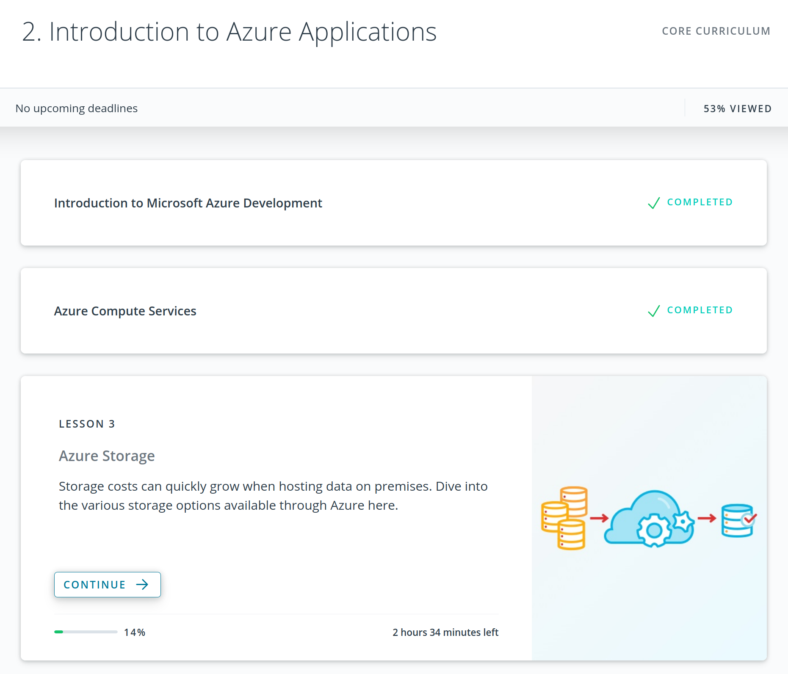

# D17: Saturday, December 19, 2020.
- I watched some video lectures.
- My current progress is "Lesson 3 - Azure Storage" (29%) - "4. Adding Data to the Database".
- I encourage @Mateusz Zatylny, @Ana Peçini, @rachael bryce, @Laura_in_VA, @Ankit Biswas, @Kaustubha Shravan, @PK, @tapti sippy, @Alberto Pardo, @Anurag Shukla, @Carlota Pearl, @John V, @priyanka hiranandani, @sreenidhi iyengar, @Skovski, @Peter to continue in the #60DaysofUdacity challenge.

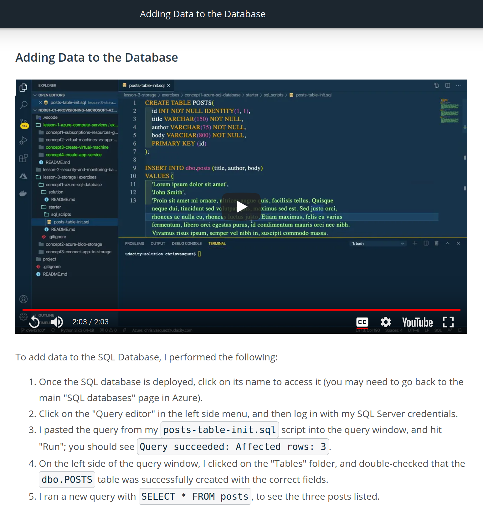

# D18: Sunday, December 20, 2020.
- I watched some video lectures.
- My current progress is "Lesson 3 - Azure Storage" (43%) - "6. Solution: Azure SQL Databases".
- I encourage @Mateusz Zatylny, @Ana Peçini, @rachael bryce, @Laura_in_VA, @Ankit Biswas, @Kaustubha Shravan, @PK, @tapti sippy, @Alberto Pardo, @Anurag Shukla, @Carlota Pearl, @John V, @priyanka hiranandani, @sreenidhi iyengar, @Skovski, @Peter to continue in the #60DaysofUdacity challenge.

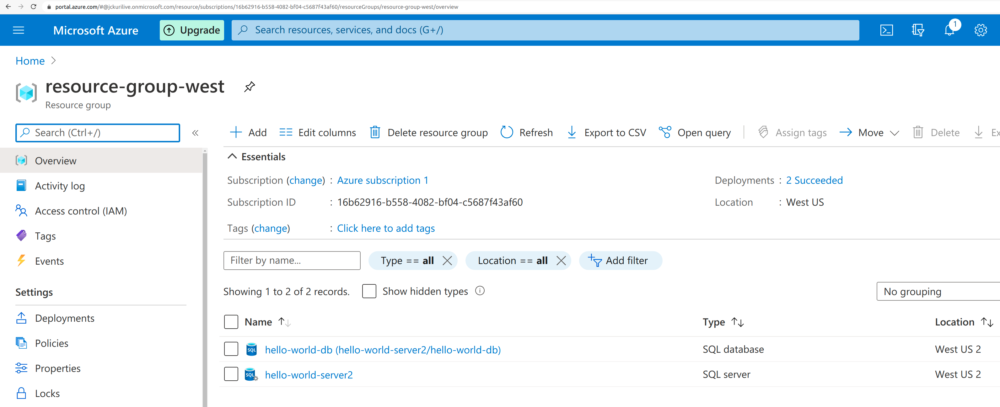

# D19: Monday, December 21, 2020.
- I watched some video lectures.
- My current progress is "Lesson 3 - Azure Storage" (50%) - "7. Blob Storage".
- I encourage @Mateusz Zatylny, @Ana Peçini, @rachael bryce, @Laura_in_VA, @Ankit Biswas, @Kaustubha Shravan, @PK, @tapti sippy, @Alberto Pardo, @Anurag Shukla, @Carlota Pearl, @John V, @priyanka hiranandani, @sreenidhi iyengar, @Skovski, @Peter to continue in the #60DaysofUdacity challenge.

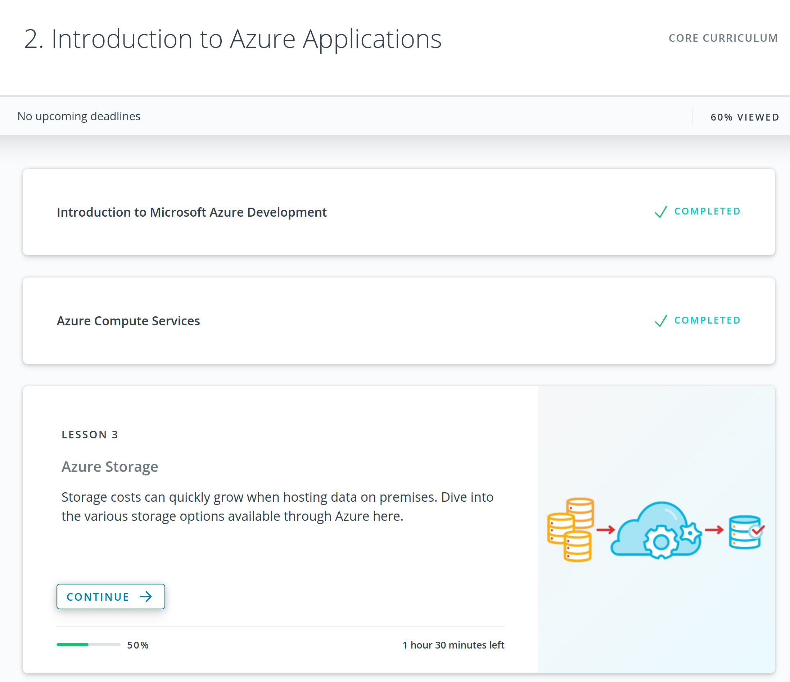

# D20: Tuesday, December 22, 2020.
- I watched some video lectures.
- My current progress is "Lesson 3 - Azure Storage" (64%) - "9. Solution: Blob Storage".
- I encourage @Mateusz Zatylny, @Ana Peçini, @rachael bryce, @Laura_in_VA, @Ankit Biswas, @Kaustubha Shravan, @PK, @tapti sippy, @Alberto Pardo, @Anurag Shukla, @Carlota Pearl, @John V, @priyanka hiranandani, @sreenidhi iyengar, @Skovski, @Peter to continue in the #60DaysofUdacity challenge.

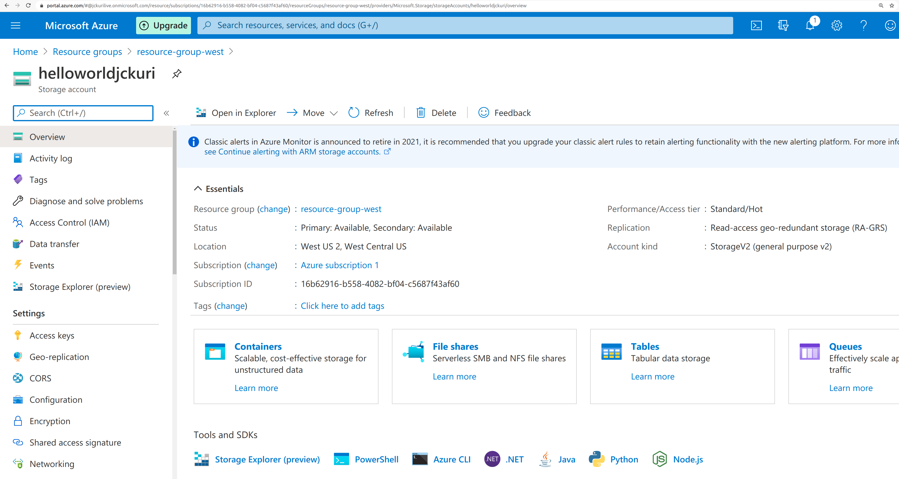
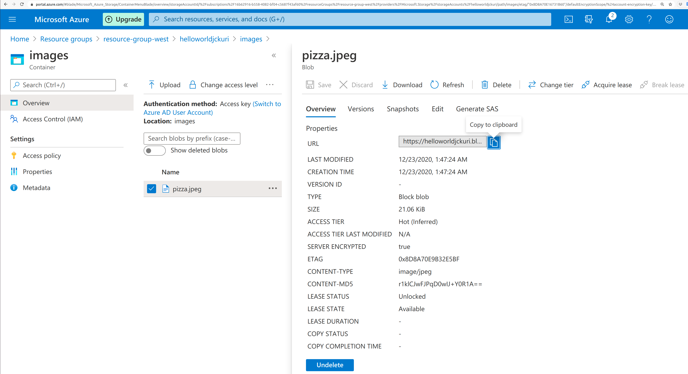

# D21: Wednesday, December 23, 2020.
- I watched some video lectures.
- My current progress is "Lesson 3 - Azure Storage" (71%) - "10. Connecting Your App to Storage".
- I encourage @Mateusz Zatylny, @Ana Peçini, @rachael bryce, @Laura_in_VA, @Ankit Biswas, @Kaustubha Shravan, @PK, @tapti sippy, @Alberto Pardo, @Anurag Shukla, @Carlota Pearl, @John V, @priyanka hiranandani, @sreenidhi iyengar, @Skovski, @Peter to continue in the #60DaysofUdacity challenge.

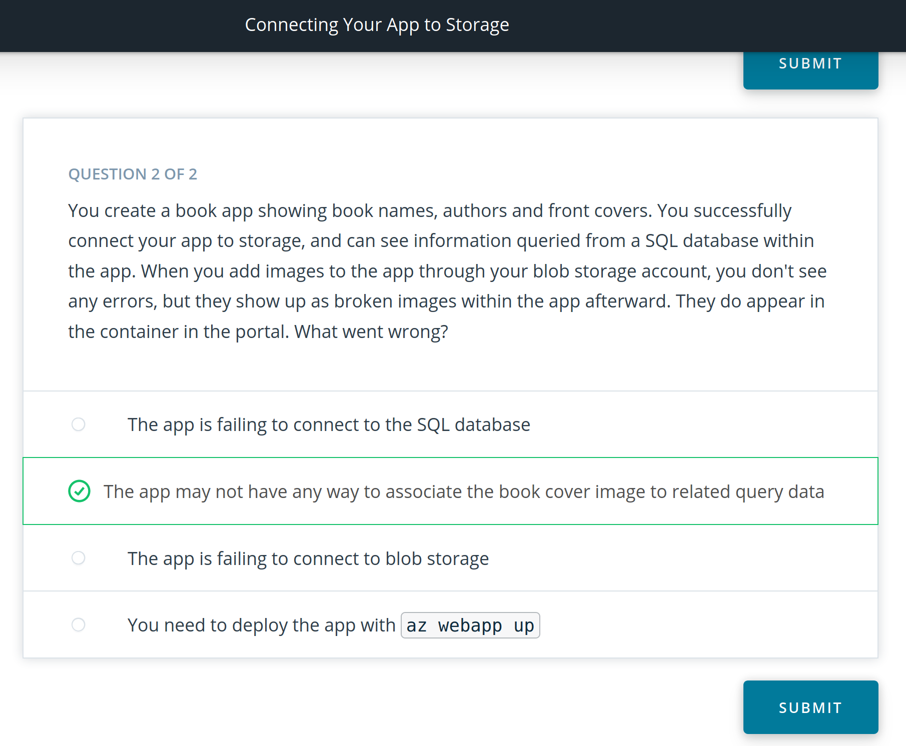

# D22: Thursday, December 24, 2020.
- I tried to understand the video lecture 11: "Exercise: Connecting Your App to Storage". But it is a little bit difficult to solve because it involves previous video lectures. So, I will try it harder tomorrow.
- My current progress is "Lesson 3 - Azure Storage" (71%) - "10. Connecting Your App to Storage".
- I encourage @Mateusz Zatylny, @Ana Peçini, @rachael bryce, @Laura_in_VA, @Ankit Biswas, @Kaustubha Shravan, @PK, @tapti sippy, @Alberto Pardo, @Anurag Shukla, @Carlota Pearl, @John V, @priyanka hiranandani, @sreenidhi iyengar, @Skovski, @Peter to continue in the #60DaysofUdacity challenge.

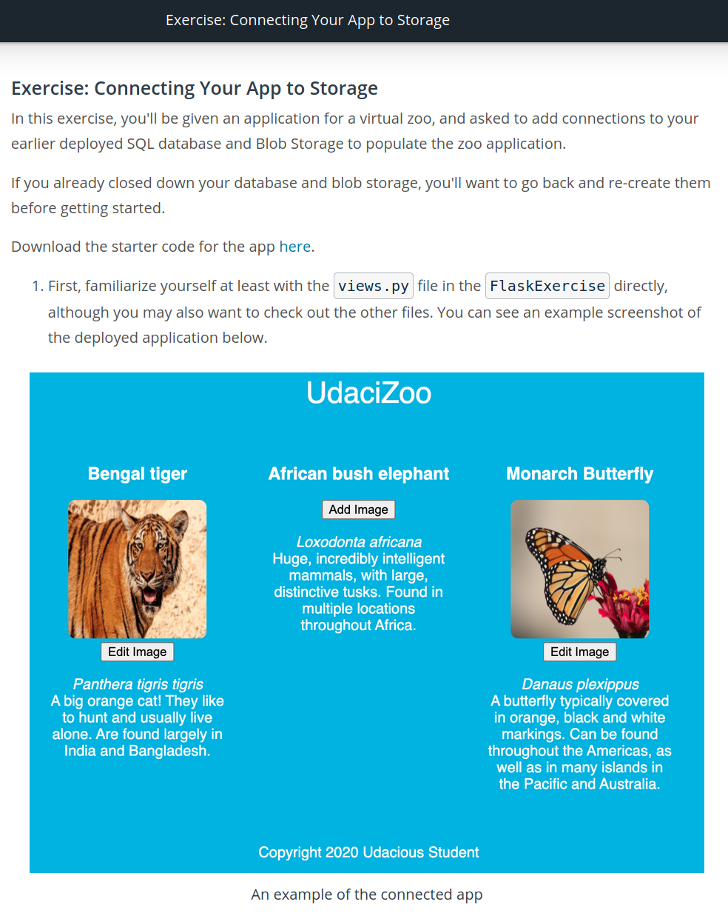

# D23: Friday, December 25, 2020.
- I watched some video lectures.
- My current progress is "Lesson 3 - Azure Storage" (86%) - "12. Solution: Connecting Your App to Storage".
- I encourage @Mateusz Zatylny, @Ana Peçini, @rachael bryce, @Laura_in_VA, @Ankit Biswas, @Kaustubha Shravan, @PK, @tapti sippy, @Alberto Pardo, @Anurag Shukla, @Carlota Pearl, @John V, @priyanka hiranandani, @sreenidhi iyengar, @Skovski, @Peter to continue in the #60DaysofUdacity challenge.

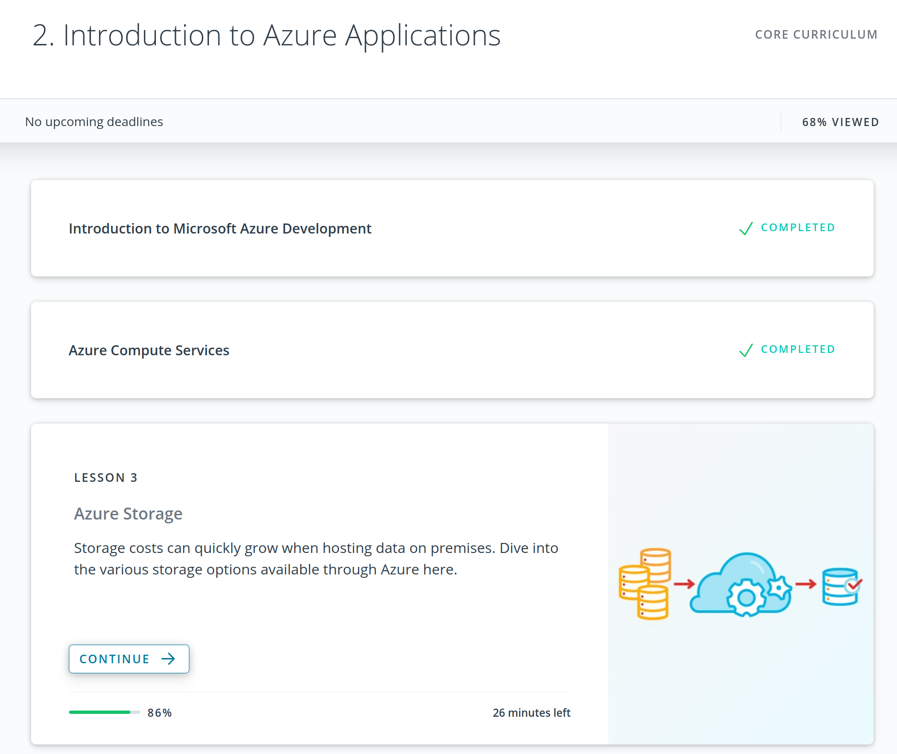

# D24: Saturday, December 26, 2020.
- I watched some video lectures.
- I managed to make the UdaciZoo webapp work. It was hard because I had too many errors to correct.
- My current progress is "Lesson 4 - Security and Monitoring Basics" (6%) - "1. Introduction".
- I encourage @Mateusz Zatylny, @Ana Peçini, @rachael bryce, @Laura_in_VA, @Ankit Biswas, @Kaustubha Shravan, @PK, @tapti sippy, @Alberto Pardo, @Anurag Shukla, @Carlota Pearl, @John V, @priyanka hiranandani, @sreenidhi iyengar, @Skovski, @Peter to continue in the #60DaysofUdacity challenge.

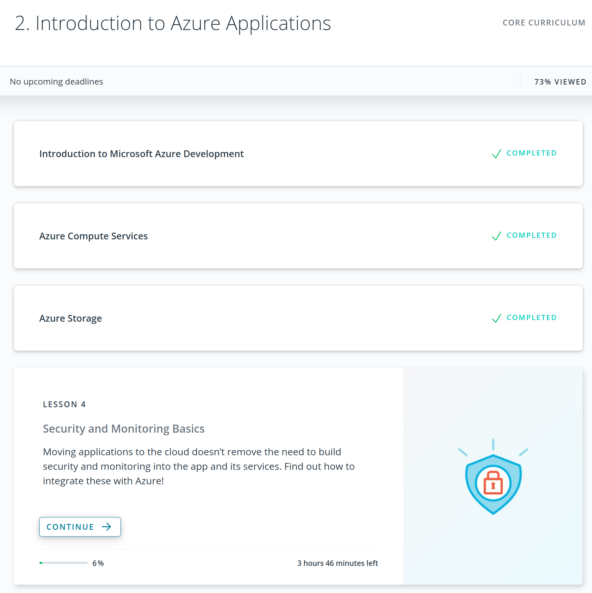

# D25: Sunday, December 27, 2020.
- I watched some video lectures.
- My current progress is "Lesson 4 - Security and Monitoring Basics" (18%) - "3. Security Options in Azure".
- I encourage @Mateusz Zatylny, @Ana Peçini, @rachael bryce, @Laura_in_VA, @Ankit Biswas, @Kaustubha Shravan, @PK, @tapti sippy, @Alberto Pardo, @Anurag Shukla, @Carlota Pearl, @John V, @priyanka hiranandani, @sreenidhi iyengar, @Skovski, @Peter to continue in the #60DaysofUdacity challenge.

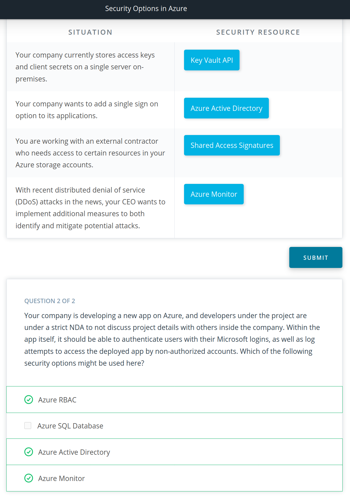

# D26: Monday, December 28, 2020.
- I watched some video lectures.
- My current progress is "Lesson 4 - Security and Monitoring Basics" (29%) - "5. Azure Active Directory".
- I encourage @Mateusz Zatylny, @Ana Peçini, @rachael bryce, @Laura_in_VA, @Ankit Biswas, @Kaustubha Shravan, @PK, @tapti sippy, @Alberto Pardo, @Anurag Shukla, @Carlota Pearl, @John V, @priyanka hiranandani, @sreenidhi iyengar, @Skovski, @Peter to continue in the #60DaysofUdacity challenge.

# D27: Tuesday, December 29, 2020.
