# 3.5-Months-of-Bertelsmann-Scholarship-Cloud-Track
3.5-Months-of-Bertelsmann-Scholarship-Cloud-Track

# Day 1: Thursday, December 3, 2020.
- I registered to the Slack channel: https://bertelsmanncloudtrack.slack.com/
- I entered the classroom at: https://classroom.udacity.com/nanodegrees/nd081-1/dashboard/overview
- I watched some video lectures.

# Day 2: Friday, December 4, 2020.
- I read the official website of this scholarship: https://sites.google.com/udacity.com/bertelsmann-tech-scholarship
- I went to the Slack channel #introductions and I introduced myself.
- I watched some video lectures.

# Day 3: Saturday, December 5, 2020.
- I watched some video lectures. My current progress is "Lesson 1 - Introduction to Microsoft Azure Development" (38%)

# Day 4: Sunday, December 6, 2020.
- I watched some video lectures. 
- My current progress is "Lesson 1 - Introduction to Microsoft Azure Development" (63%) - "10. The Azure Portal".

# Day 5: Monday, December 7, 2020.
- I tried to enter the Phase 1 Orientation but I couldn't: "This meeting has reached a maximum of 1000 participants. Please try again later."
- I watched the recording of the Phase 1 Orientation.

# Day 6: Tuesday, December 8, 2020.
- I watched some video lectures. 
- My current progress is "Lesson 1 - Introduction to Microsoft Azure Development" (69%) - "11. IaaS, PaaS, and SaaS".

# Day 7: Wednesday, December 9, 2020.
- I watched some video lectures. 
- My current progress is "Lesson 1 - Introduction to Microsoft Azure Development" (75%) - "12. Tools & Environment".

# D8: Thursday, December 10, 2020.
- I submitted the "Cloud Track #60DaysofUdacity Challenge - Pledge Form".
- I watched some video lectures.
- My current progress is "Lesson 2 - Azure Compute Services" (6%) - "1. Introduction".
- I encourage @Mateusz Zatylny, @Ana Peçini, @rachael bryce to continue in the #60DaysofUdacity challenge.

# D9: Friday, December 11, 2020.
- I watched some video lectures.
- My current progress is "Lesson 2 - Azure Compute Services" (25%) - "4. Exercise: Create A Resource Group".
- I encourage @Mateusz Zatylny, @Ana Peçini, @rachael bryce, @Laura_in_VA, @Ankit Biswas, @Kaustubha Shravan, @PK, @tapti sippy, @Alberto Pardo, @Anurag Shukla, @Carlota Pearl, @John V to continue in the #60DaysofUdacity challenge.

# D10: Saturday, December 12, 2020.
- I watched some video lectures.
- My current progress is "Lesson 2 - Azure Compute Services" (38%) - "6. Virtual Machines vs. App Services".
- I encourage @Mateusz Zatylny, @Ana Peçini, @rachael bryce, @Laura_in_VA, @Ankit Biswas, @Kaustubha Shravan, @PK, @tapti sippy, @Alberto Pardo, @Anurag Shukla, @Carlota Pearl, @John V, @priyanka hiranandani, @sreenidhi iyengar, @Skovski, @Peter to continue in the #60DaysofUdacity challenge.

# D11: Sunday, December 13, 2020.
- I watched some video lectures.
- My current progress is "Lesson 2 - Azure Compute Services" (50%) - "8. Solution: Virtual Machines vs. App Services".
- I encourage @Mateusz Zatylny, @Ana Peçini, @rachael bryce, @Laura_in_VA, @Ankit Biswas, @Kaustubha Shravan, @PK, @tapti sippy, @Alberto Pardo, @Anurag Shukla, @Carlota Pearl, @John V, @priyanka hiranandani, @sreenidhi iyengar, @Skovski, @Peter to continue in the #60DaysofUdacity challenge.

# D12: Monday, December 14, 2020.
- I watched some video lectures.
- My current progress is "Lesson 2 - Azure Compute Services" (63%) - "10. Exercise: Creating a Virtual Machine".
- I encourage @Mateusz Zatylny, @Ana Peçini, @rachael bryce, @Laura_in_VA, @Ankit Biswas, @Kaustubha Shravan, @PK, @tapti sippy, @Alberto Pardo, @Anurag Shukla, @Carlota Pearl, @John V, @priyanka hiranandani, @sreenidhi iyengar, @Skovski, @Peter to continue in the #60DaysofUdacity challenge.

# D13: Tuesday, December 15, 2020.
- I watched some video lectures.
- My current progress is "Lesson 2 - Azure Compute Services" (75%) - "12. Creating an App Service".
- I encourage @Mateusz Zatylny, @Ana Peçini, @rachael bryce, @Laura_in_VA, @Ankit Biswas, @Kaustubha Shravan, @PK, @tapti sippy, @Alberto Pardo, @Anurag Shukla, @Carlota Pearl, @John V, @priyanka hiranandani, @sreenidhi iyengar, @Skovski, @Peter to continue in the #60DaysofUdacity challenge.

# D14: Wednesday, December 16, 2020.
- I created an App Service.
- My current progress is "Lesson 2 - Azure Compute Services" (75%) - "13. Exercise: Creating an App Service".
- I encourage @Mateusz Zatylny, @Ana Peçini, @rachael bryce, @Laura_in_VA, @Ankit Biswas, @Kaustubha Shravan, @PK, @tapti sippy, @Alberto Pardo, @Anurag Shukla, @Carlota Pearl, @John V, @priyanka hiranandani, @sreenidhi iyengar, @Skovski, @Peter to continue in the #60DaysofUdacity challenge.

# D15: Thursday, December 17, 2020.
- I finished all the lectures of "Lesson 2 - Azure Compute Services".
- My current progress is "Lesson 2 - Azure Compute Services" (100%) - "16. Glossary".
- I encourage @Mateusz Zatylny, @Ana Peçini, @rachael bryce, @Laura_in_VA, @Ankit Biswas, @Kaustubha Shravan, @PK, @tapti sippy, @Alberto Pardo, @Anurag Shukla, @Carlota Pearl, @John V, @priyanka hiranandani, @sreenidhi iyengar, @Skovski, @Peter to continue in the #60DaysofUdacity challenge.

# D16: Friday, December 18, 2020.
- I watched some video lectures.
- My current progress is "Lesson 3 - Azure Storage" (14%) - "2. Big Picture: Storage".
- I encourage @Mateusz Zatylny, @Ana Peçini, @rachael bryce, @Laura_in_VA, @Ankit Biswas, @Kaustubha Shravan, @PK, @tapti sippy, @Alberto Pardo, @Anurag Shukla, @Carlota Pearl, @John V, @priyanka hiranandani, @sreenidhi iyengar, @Skovski, @Peter to continue in the #60DaysofUdacity challenge.

# D17: Saturday, December 19, 2020.
- I watched some video lectures.
- My current progress is "Lesson 3 - Azure Storage" (29%) - "4. Adding Data to the Database".
- I encourage @Mateusz Zatylny, @Ana Peçini, @rachael bryce, @Laura_in_VA, @Ankit Biswas, @Kaustubha Shravan, @PK, @tapti sippy, @Alberto Pardo, @Anurag Shukla, @Carlota Pearl, @John V, @priyanka hiranandani, @sreenidhi iyengar, @Skovski, @Peter to continue in the #60DaysofUdacity challenge.

# D18: Sunday, December 20, 2020.
- I watched some video lectures.
- My current progress is "Lesson 3 - Azure Storage" (43%) - "6. Solution: Azure SQL Databases".
- I encourage @Mateusz Zatylny, @Ana Peçini, @rachael bryce, @Laura_in_VA, @Ankit Biswas, @Kaustubha Shravan, @PK, @tapti sippy, @Alberto Pardo, @Anurag Shukla, @Carlota Pearl, @John V, @priyanka hiranandani, @sreenidhi iyengar, @Skovski, @Peter to continue in the #60DaysofUdacity challenge.

# D19: Monday, December 21, 2020.
- I watched some video lectures.
- My current progress is "Lesson 3 - Azure Storage" (50%) - "7. Blob Storage".
- I encourage @Mateusz Zatylny, @Ana Peçini, @rachael bryce, @Laura_in_VA, @Ankit Biswas, @Kaustubha Shravan, @PK, @tapti sippy, @Alberto Pardo, @Anurag Shukla, @Carlota Pearl, @John V, @priyanka hiranandani, @sreenidhi iyengar, @Skovski, @Peter to continue in the #60DaysofUdacity challenge.

# D20: Tuesday, December 22, 2020.
- I watched some video lectures.
- My current progress is "Lesson 3 - Azure Storage" (64%) - "9. Solution: Blob Storage".
- I encourage @Mateusz Zatylny, @Ana Peçini, @rachael bryce, @Laura_in_VA, @Ankit Biswas, @Kaustubha Shravan, @PK, @tapti sippy, @Alberto Pardo, @Anurag Shukla, @Carlota Pearl, @John V, @priyanka hiranandani, @sreenidhi iyengar, @Skovski, @Peter to continue in the #60DaysofUdacity challenge.

# D21: Wednesday, December 23, 2020.
- I watched some video lectures.
- My current progress is "Lesson 3 - Azure Storage" (71%) - "10. Connecting Your App to Storage".
- I encourage @Mateusz Zatylny, @Ana Peçini, @rachael bryce, @Laura_in_VA, @Ankit Biswas, @Kaustubha Shravan, @PK, @tapti sippy, @Alberto Pardo, @Anurag Shukla, @Carlota Pearl, @John V, @priyanka hiranandani, @sreenidhi iyengar, @Skovski, @Peter to continue in the #60DaysofUdacity challenge.

# D22: Thursday, December 24, 2020.
- I tried to understand the video lecture 11: "Exercise: Connecting Your App to Storage". But it is a little bit difficult to solve because it involves previous video lectures. So, I will try it harder tomorrow.
- My current progress is "Lesson 3 - Azure Storage" (71%) - "10. Connecting Your App to Storage".
- I encourage @Mateusz Zatylny, @Ana Peçini, @rachael bryce, @Laura_in_VA, @Ankit Biswas, @Kaustubha Shravan, @PK, @tapti sippy, @Alberto Pardo, @Anurag Shukla, @Carlota Pearl, @John V, @priyanka hiranandani, @sreenidhi iyengar, @Skovski, @Peter to continue in the #60DaysofUdacity challenge.

# D23: Friday, December 25, 2020.
- I watched some video lectures.
- My current progress is "Lesson 3 - Azure Storage" (86%) - "12. Solution: Connecting Your App to Storage".
- I encourage @Mateusz Zatylny, @Ana Peçini, @rachael bryce, @Laura_in_VA, @Ankit Biswas, @Kaustubha Shravan, @PK, @tapti sippy, @Alberto Pardo, @Anurag Shukla, @Carlota Pearl, @John V, @priyanka hiranandani, @sreenidhi iyengar, @Skovski, @Peter to continue in the #60DaysofUdacity challenge.

# D24: Saturday, December 26, 2020.
- I watched some video lectures.
- I managed to make the UdaciZoo webapp work. It was hard because I had too many errors to correct.
- My current progress is "Lesson 4 - Security and Monitoring Basics" (6%) - "1. Introduction".
- I encourage @Mateusz Zatylny, @Ana Peçini, @rachael bryce, @Laura_in_VA, @Ankit Biswas, @Kaustubha Shravan, @PK, @tapti sippy, @Alberto Pardo, @Anurag Shukla, @Carlota Pearl, @John V, @priyanka hiranandani, @sreenidhi iyengar, @Skovski, @Peter to continue in the #60DaysofUdacity challenge.

# D25: Sunday, December 27, 2020.
- I watched some video lectures.
- My current progress is "Lesson 4 - Security and Monitoring Basics" (18%) - "3. Security Options in Azure".
- I encourage @Mateusz Zatylny, @Ana Peçini, @rachael bryce, @Laura_in_VA, @Ankit Biswas, @Kaustubha Shravan, @PK, @tapti sippy, @Alberto Pardo, @Anurag Shukla, @Carlota Pearl, @John V, @priyanka hiranandani, @sreenidhi iyengar, @Skovski, @Peter to continue in the #60DaysofUdacity challenge.

# D26: Monday, December 28, 2020.
- I watched some video lectures.
- My current progress is "Lesson 4 - Security and Monitoring Basics" (29%) - "5. Azure Active Directory".
- I encourage @Mateusz Zatylny, @Ana Peçini, @rachael bryce, @Laura_in_VA, @Ankit Biswas, @Kaustubha Shravan, @PK, @tapti sippy, @Alberto Pardo, @Anurag Shukla, @Carlota Pearl, @John V, @priyanka hiranandani, @sreenidhi iyengar, @Skovski, @Peter to continue in the #60DaysofUdacity challenge.

# D27: Tuesday, December 29, 2020.
- I watched some video lectures.
- I joined the study group #sg_latam.
- My current progress is "Lesson 4 - Security and Monitoring Basics" (41%) - "7. Solution: Azure Active Directory".
- I encourage @Mateusz Zatylny, @Ana Peçini, @rachael bryce, @Laura_in_VA, @Ankit Biswas, @Kaustubha Shravan, @PK, @tapti sippy, @Alberto Pardo, @Anurag Shukla, @Carlota Pearl, @John V, @priyanka hiranandani, @sreenidhi iyengar, @Skovski, @Peter Ojo, @Camila Andrea González Williamson, @Sai Ganesh, @Sohit, @Rushikesh Thombre, @Danur Wijayanto, @Omar, @Martin Kramer, @Prnika Bakshi, @Manasvi Trivedi, to continue in the #60DaysofUdacity challenge.

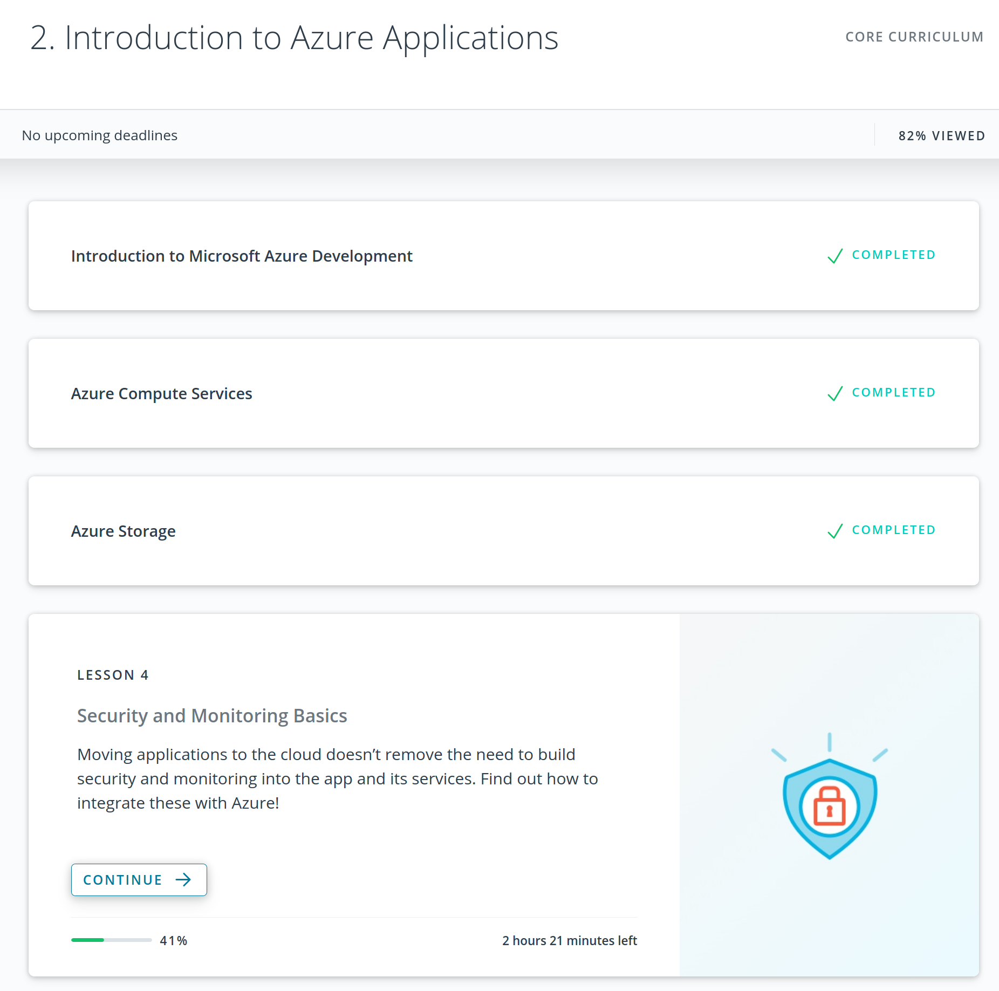

# D28: Wednesday, December 30, 2020.
- I watched some video lectures.
- I introduced myself in the study group #sg_latam.
- My current progress is "Lesson 4 - Security and Monitoring Basics" (53%) - "9. OAuth2 with MSAL Part 2".
- I encourage @Mateusz Zatylny, @Ana Peçini, @rachael bryce, @Laura_in_VA, @Ankit Biswas, @Kaustubha Shravan, @PK, @tapti sippy, @Alberto Pardo, @Anurag Shukla, @Carlota Pearl, @John V, @priyanka hiranandani, @sreenidhi iyengar, @Skovski, @Peter Ojo, @Camila Andrea González Williamson, @Sai Ganesh, @Sohit, @Rushikesh Thombre, @Danur Wijayanto, @Omar, @Martin Kramer, @Prnika Bakshi, @Manasvi Trivedi, to continue in the #60DaysofUdacity challenge.

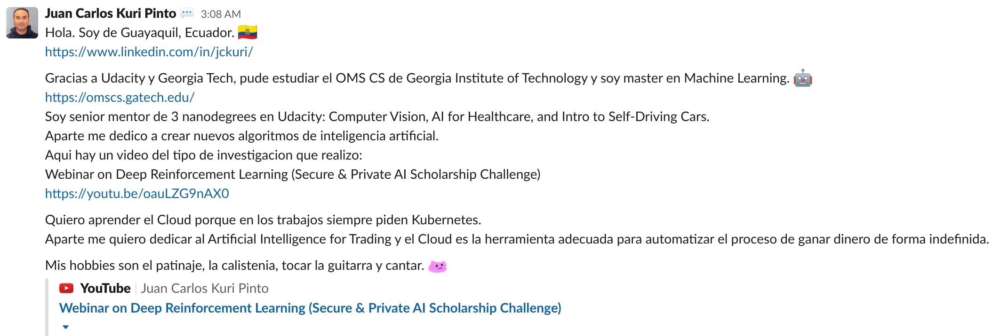

# D29: Thursday, December 31, 2020.
- I'm trying to understand the "Lecture 10. Exercise: OAuth2 with MSAL."
- My current progress is "Lesson 4 - Security and Monitoring Basics" (59%) - 10. Exercise: OAuth2 with MSAL"
- I encourage @Mateusz Zatylny, @Ana Peçini, @rachael bryce, @Laura_in_VA, @Ankit Biswas, @Kaustubha Shravan, @PK, @tapti sippy, @Alberto Pardo, @Anurag Shukla, @Carlota Pearl, @John V, @priyanka hiranandani, @sreenidhi iyengar, @Skovski, @Peter Ojo, @Camila Andrea González Williamson, @Sai Ganesh, @Sohit, @Rushikesh Thombre, @Danur Wijayanto, @Omar, @Martin Kramer, @Prnika Bakshi, @Manasvi Trivedi, to continue in the #60DaysofUdacity challenge.

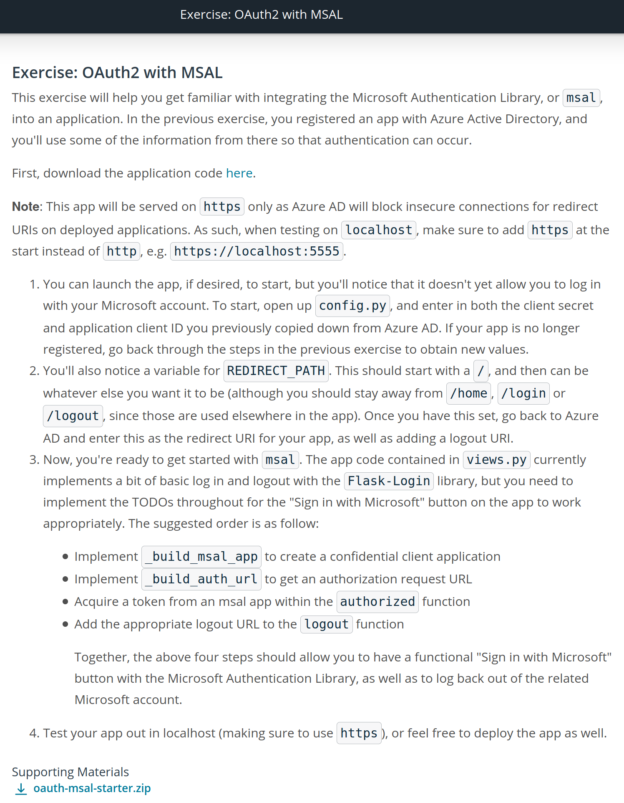

# D30: Friday, January 1, 2021.
- I'm still trying to understand the Exercise: OAuth2 with MSAL.
- My current progress is "Lesson 4 - Security and Monitoring Basics" (65%) - 11. Solution: OAuth2 with MSAL"
- I encourage @Mateusz Zatylny, @Ana Peçini, @rachael bryce, @Laura_in_VA, @Ankit Biswas, @Kaustubha Shravan, @PK, @tapti sippy, @Alberto Pardo, @Anurag Shukla, @Carlota Pearl, @John V, @priyanka hiranandani, @sreenidhi iyengar, @Skovski, @Peter Ojo, @Camila Andrea González Williamson, @Sai Ganesh, @Sohit, @Rushikesh Thombre, @Danur Wijayanto, @Omar, @Martin Kramer, @Prnika Bakshi, @Manasvi Trivedi, to continue in the #60DaysofUdacity challenge.

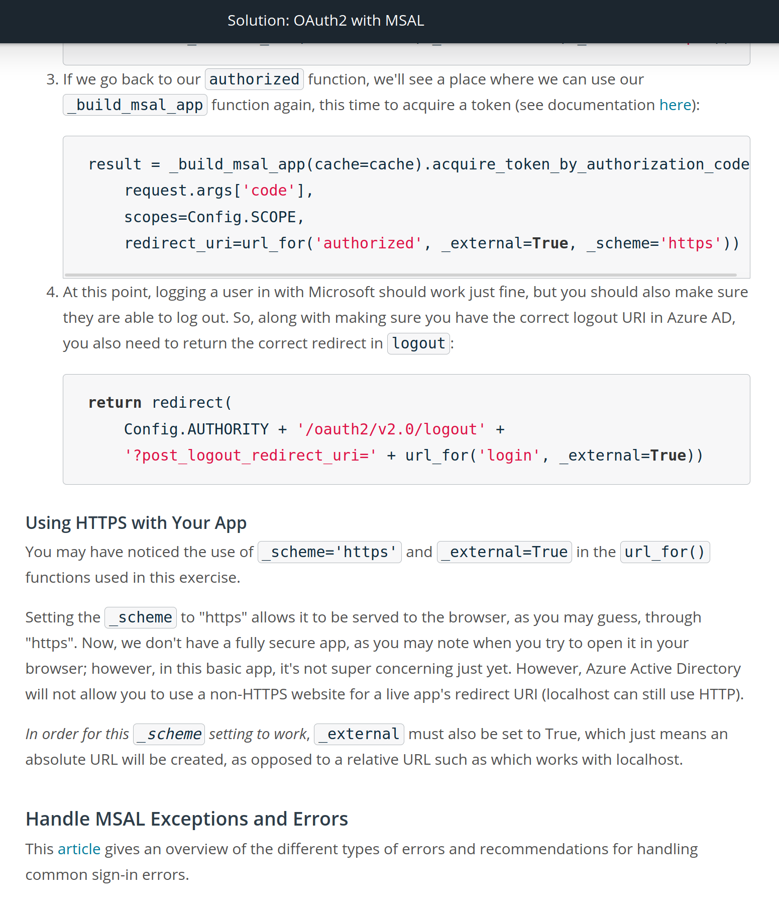

# D31: Saturday, January 2, 2021.
- I finally finished programming the Exercise: OAuth2 with MSAL.
- My current progress is "Lesson 4 - Security and Monitoring Basics" (71%) - 12. Monitoring and Logging in Azure"
- I encourage @Mateusz Zatylny, @Ana Peçini, @rachael bryce, @Laura_in_VA, @Ankit Biswas, @Kaustubha Shravan, @PK, @tapti sippy, @Alberto Pardo, @Anurag Shukla, @Carlota Pearl, @John V, @priyanka hiranandani, @sreenidhi iyengar, @Skovski, @Peter Ojo, @Camila Andrea González Williamson, @Sai Ganesh, @Sohit, @Rushikesh Thombre, @Danur Wijayanto, @Omar, @Martin Kramer, @Prnika Bakshi, @Manasvi Trivedi, to continue in the #60DaysofUdacity challenge.

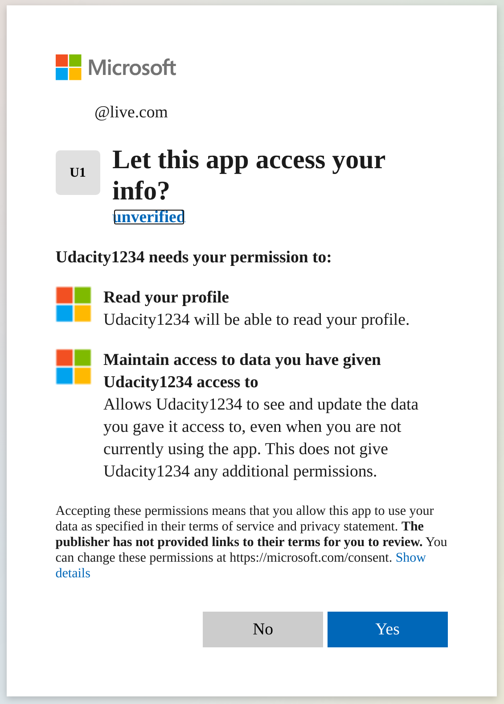
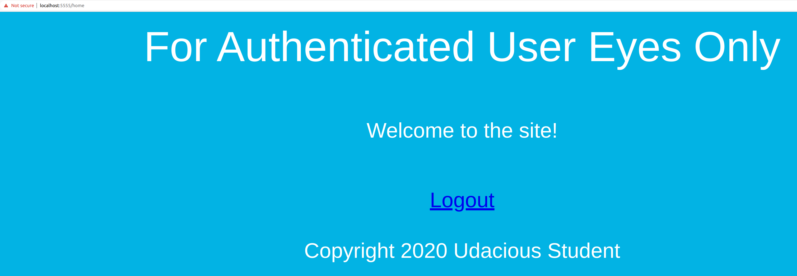
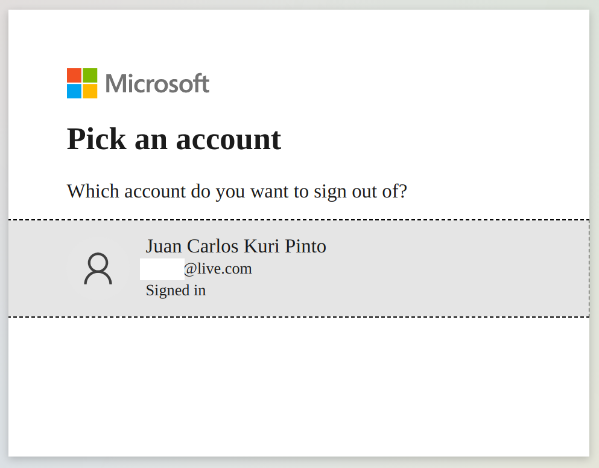
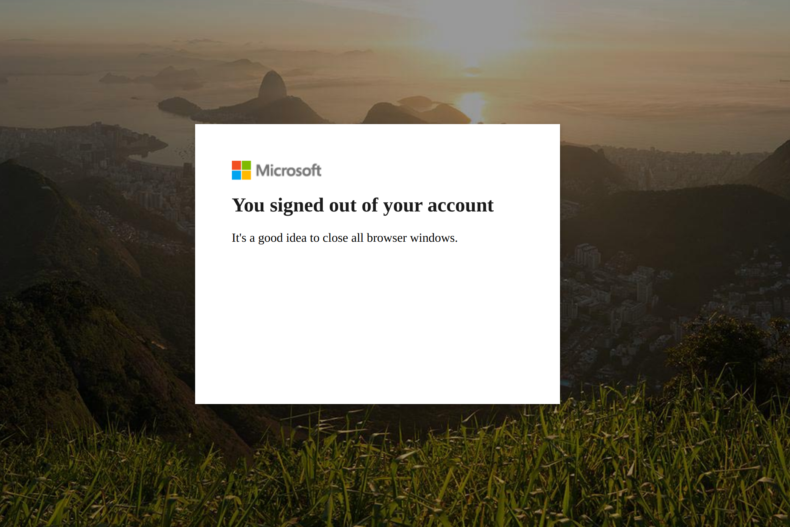

# D32: Sunday, January 3, 2021.
- I'm trying to understand the Exercise: Monitoring and Logging in Azure.
- My current progress is "Lesson 4 - Security and Monitoring Basics" (76%) - 13. Exercise: Monitoring and Logging in Azure"
- I encourage @Mateusz Zatylny, @Ana Peçini, @rachael bryce, @Laura_in_VA, @Ankit Biswas, @Kaustubha Shravan, @PK, @tapti sippy, @Alberto Pardo, @Anurag Shukla, @Carlota Pearl, @John V, @priyanka hiranandani, @sreenidhi iyengar, @Skovski, @Peter Ojo, @Camila Andrea González Williamson, @Sai Ganesh, @Sohit, @Rushikesh Thombre, @Danur Wijayanto, @Omar, @Martin Kramer, @Prnika Bakshi, @Manasvi Trivedi, @fame chailert, @Livinus Igbaji, @Maria Jose Davila B, @G, @Maaz Ali, to continue in the #60DaysofUdacity challenge.

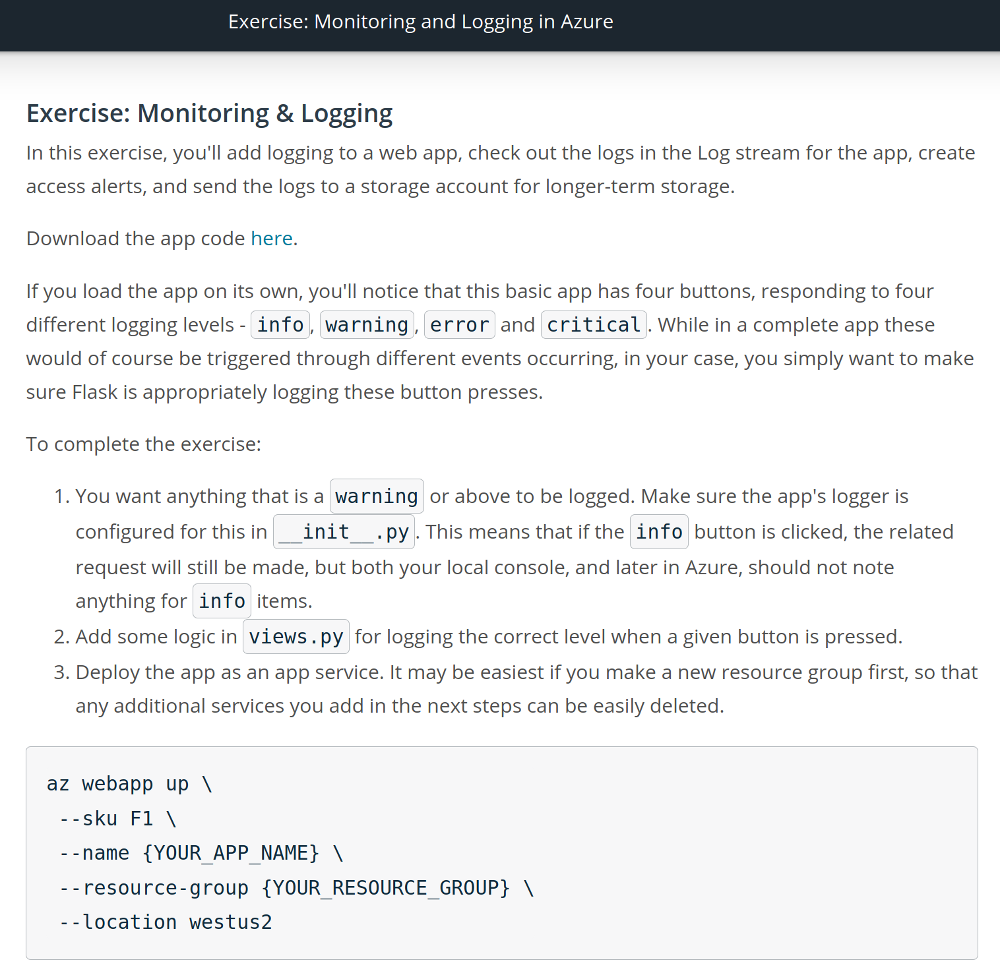

# D33: Monday, January 4, 2021.
- I'm still trying to understand the Exercise: Monitoring and Logging in Azure.
- My current progress is "Lesson 4 - Security and Monitoring Basics" (76%) - 13. Exercise: Monitoring and Logging in Azure"
- I encourage @Mateusz Zatylny, @Ana Peçini, @rachael bryce, @Laura_in_VA, @Ankit Biswas, @Kaustubha Shravan, @PK, @tapti sippy, @Alberto Pardo, @Anurag Shukla, @Carlota Pearl, @John V, @priyanka hiranandani, @sreenidhi iyengar, @Skovski, @Peter Ojo, @Camila Andrea González Williamson, @Sai Ganesh, @Sohit, @Rushikesh Thombre, @Danur Wijayanto, @Omar, @Martin Kramer, @Prnika Bakshi, @Manasvi Trivedi, @fame chailert, @Livinus Igbaji, @Maria Jose Davila B, @G, @Maaz Ali, to continue in the #60DaysofUdacity challenge.

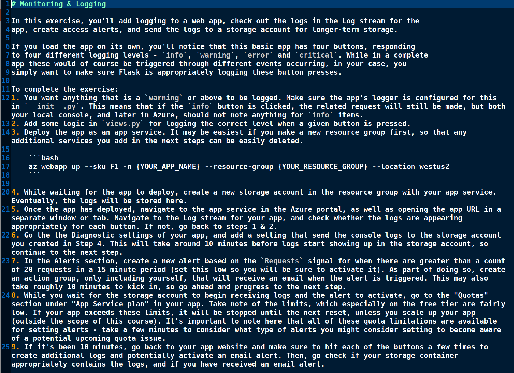

# D34: Tuesday, January 5, 2021.
- I'm still trying to understand the Exercise: Monitoring and Logging in Azure. I've been busy.
- My current progress is "Lesson 4 - Security and Monitoring Basics" (82%) - 14. Solution: Monitoring and Logging in Azure"
- I encourage @Mateusz Zatylny, @Ana Peçini, @rachael bryce, @Laura_in_VA, @Ankit Biswas, @Kaustubha Shravan, @PK, @tapti sippy, @Alberto Pardo, @Anurag Shukla, @Carlota Pearl, @John V, @priyanka hiranandani, @sreenidhi iyengar, @Skovski, @Peter Ojo, @Camila Andrea González Williamson, @Sai Ganesh, @Sohit, @Rushikesh Thombre, @Danur Wijayanto, @Omar, @Martin Kramer, @Prnika Bakshi, @Manasvi Trivedi, @fame chailert, @Livinus Igbaji, @Maria Jose Davila B, @G, @Maaz Ali, to continue in the #60DaysofUdacity challenge.

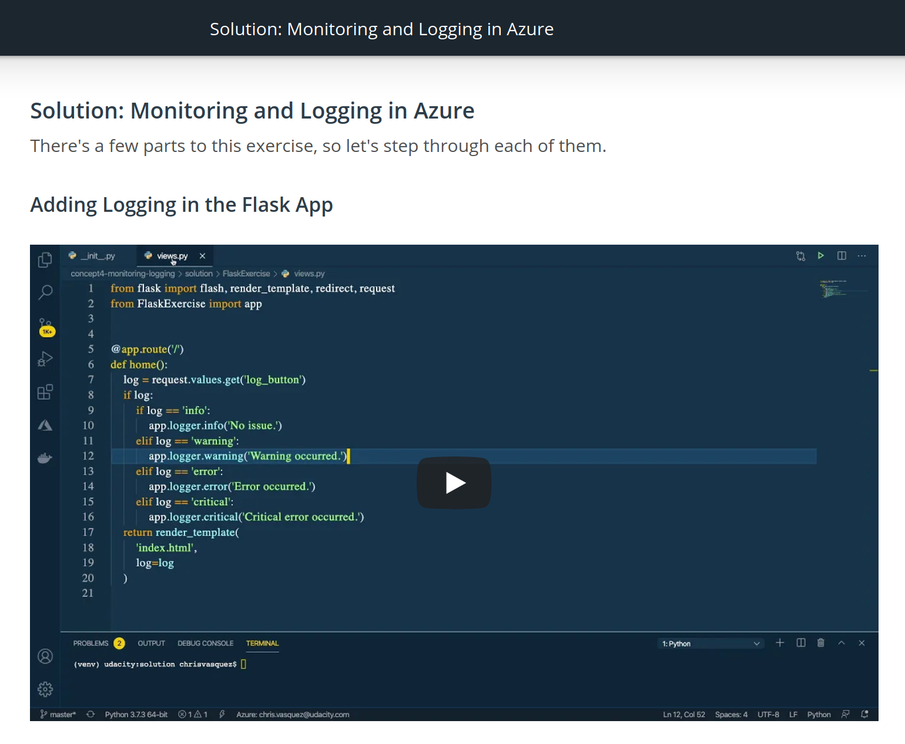

# D35: Wednesday, January 6, 2021.
- I'm analyzing the source code of the Exercise: Monitoring and Logging in Azure.
- My current progress is "Lesson 4 - Security and Monitoring Basics" (82%) - 14. Solution: Monitoring and Logging in Azure"
- I encourage @Mateusz Zatylny, @Ana Peçini, @rachael bryce, @Laura_in_VA, @Ankit Biswas, @Kaustubha Shravan, @PK, @tapti sippy, @Alberto Pardo, @Anurag Shukla, @Carlota Pearl, @John V, @priyanka hiranandani, @sreenidhi iyengar, @Skovski, @Peter Ojo, @Camila Andrea González Williamson, @Sai Ganesh, @Sohit, @Rushikesh Thombre, @Danur Wijayanto, @Omar, @Martin Kramer, @Prnika Bakshi, @Manasvi Trivedi, @fame chailert, @Livinus Igbaji, @Maria Jose Davila B, @G, @Maaz Ali, to continue in the #60DaysofUdacity challenge.

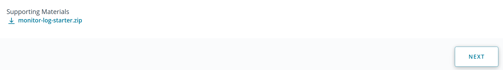

# D36: Thursday, January 7, 2021.
- I managed to finish programming the Exercise: Monitoring and Logging in Azure.
- My current progress is "Lesson 4 - Security and Monitoring Basics" (100%) - 17. Course Recap"
- I've completed all of the Course Outline!
- I encourage @Mateusz Zatylny, @Ana Peçini, @rachael bryce, @Laura_in_VA, @Ankit Biswas, @Kaustubha Shravan, @PK, @tapti sippy, @Alberto Pardo, @Anurag Shukla, @Carlota Pearl, @John V, @priyanka hiranandani, @sreenidhi iyengar, @Skovski, @Peter Ojo, @Camila Andrea González Williamson, @Sai Ganesh, @Sohit, @Rushikesh Thombre, @Danur Wijayanto, @Omar, @Martin Kramer, @Prnika Bakshi, @Manasvi Trivedi, @fame chailert, @Livinus Igbaji, @Maria Jose Davila B, @G, @Maaz Ali, to continue in the #60DaysofUdacity challenge.

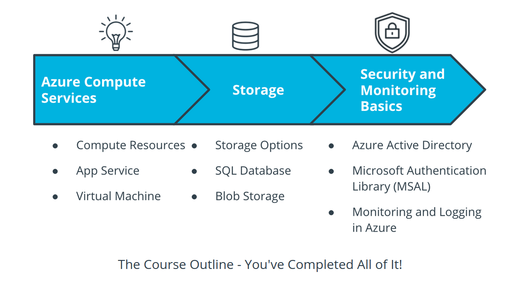

# D37: Friday, January 8, 2021.
- I checked that everything is working fine with my app service "LogApp2" (the Exercise: Monitoring and Logging in Azure).
- I'm reading everything about "Lesson 5 - Project: Deploy an Article CMS to Azure".
- I encourage @Mateusz Zatylny, @Ana Peçini, @rachael bryce, @Laura_in_VA, @Ankit Biswas, @Kaustubha Shravan, @PK, @tapti sippy, @Alberto Pardo, @Anurag Shukla, @Carlota Pearl, @John V, @priyanka hiranandani, @sreenidhi iyengar, @Skovski, @Peter Ojo, @Camila Andrea González Williamson, @Sai Ganesh, @Sohit, @Rushikesh Thombre, @Danur Wijayanto, @Omar, @Martin Kramer, @Prnika Bakshi, @Manasvi Trivedi, @fame chailert, @Livinus Igbaji, @Maria Jose Davila B, @G, @Maaz Ali, to continue in the #60DaysofUdacity challenge.

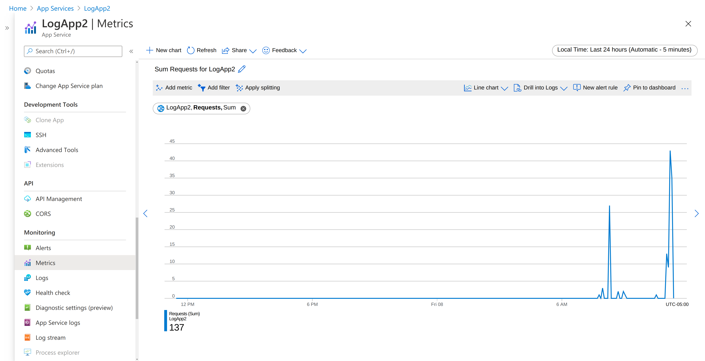

# D38: Saturday, January 9, 2021.
- I'm reading everything about "Lesson 5 - Project: Deploy an Article CMS to Azure".
- I encourage @Mateusz Zatylny, @Ana Peçini, @rachael bryce, @Laura_in_VA, @Ankit Biswas, @Kaustubha Shravan, @PK, @tapti sippy, @Alberto Pardo, @Anurag Shukla, @Carlota Pearl, @John V, @priyanka hiranandani, @sreenidhi iyengar, @Skovski, @Peter Ojo, @Camila Andrea González Williamson, @Sai Ganesh, @Sohit, @Rushikesh Thombre, @Danur Wijayanto, @Omar, @Martin Kramer, @Prnika Bakshi, @Manasvi Trivedi, @fame chailert, @Livinus Igbaji, @Maria Jose Davila B, @G, @Maaz Ali, to continue in the #60DaysofUdacity challenge.

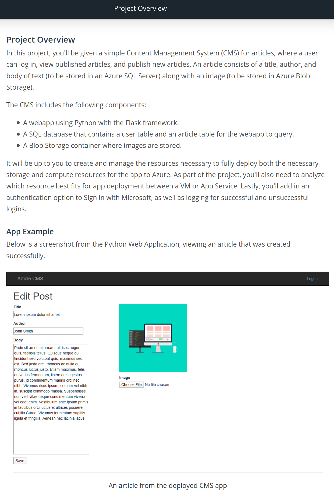

# D39: Sunday, January 10, 2021.
- I'm still trying to understand everything about "Lesson 5 - Project: Deploy an Article CMS to Azure".
- I encourage @Mateusz Zatylny, @Ana Peçini, @rachael bryce, @Laura_in_VA, @Ankit Biswas, @Kaustubha Shravan, @PK, @tapti sippy, @Alberto Pardo, @Anurag Shukla, @Carlota Pearl, @John V, @priyanka hiranandani, @sreenidhi iyengar, @Skovski, @Peter Ojo, @Camila Andrea González Williamson, @Sai Ganesh, @Sohit, @Rushikesh Thombre, @Danur Wijayanto, @Omar, @Martin Kramer, @Prnika Bakshi, @Manasvi Trivedi, @fame chailert, @Livinus Igbaji, @Maria Jose Davila B, @G, @Maaz Ali, to continue in the #60DaysofUdacity challenge.

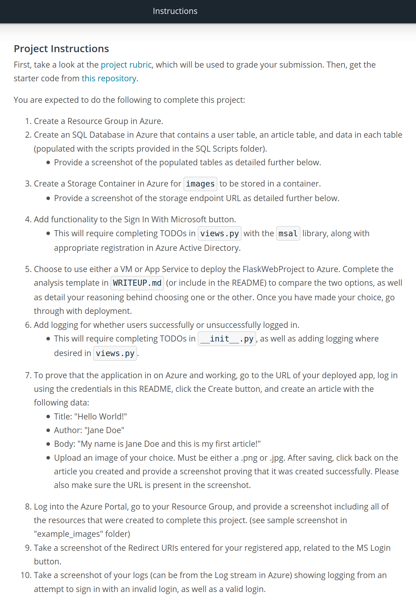

# D40: Monday, January 11, 2021.
- I'm programming "Lesson 5 - Project: Deploy an Article CMS to Azure".
- I encourage @Mateusz Zatylny, @Ana Peçini, @rachael bryce, @Laura_in_VA, @Ankit Biswas, @Kaustubha Shravan, @PK, @tapti sippy, @Alberto Pardo, @Anurag Shukla, @Carlota Pearl, @John V, @priyanka hiranandani, @sreenidhi iyengar, @Skovski, @Peter Ojo, @Camila Andrea González Williamson, @Sai Ganesh, @Sohit, @Rushikesh Thombre, @Danur Wijayanto, @Omar, @Martin Kramer, @Prnika Bakshi, @Manasvi Trivedi, @fame chailert, @Livinus Igbaji, @Maria Jose Davila B, @G, @Maaz Ali, to continue in the #60DaysofUdacity challenge.

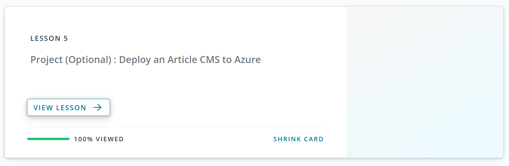

# D41: Tuesday, January 12, 2021.
- I've been thinking about what to write for the "Student Stories Challenge".
- I encourage @Mateusz Zatylny, @Ana Peçini, @rachael bryce, @Laura_in_VA, @Ankit Biswas, @Kaustubha Shravan, @PK, @tapti sippy, @Alberto Pardo, @Anurag Shukla, @Carlota Pearl, @John V, @priyanka hiranandani, @sreenidhi iyengar, @Skovski, @Peter Ojo, @Camila Andrea González Williamson, @Sai Ganesh, @Sohit, @Rushikesh Thombre, @Danur Wijayanto, @Omar, @Martin Kramer, @Prnika Bakshi, @Manasvi Trivedi, @fame chailert, @Livinus Igbaji, @Maria Jose Davila B, @G, @Maaz Ali, to continue in the #60DaysofUdacity challenge.

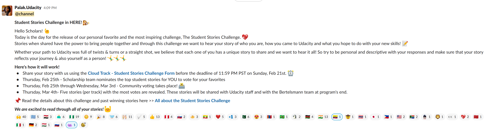

# D42: Wednesday, January 13, 2021.
- I completed the "Midpoint Survey - Bertelsmann Technology Scholarship Program - Cloud Track".
- I've been brainstorming about what to write for the "Student Stories Challenge".
- I encourage @Mateusz Zatylny, @Ana Peçini, @rachael bryce, @Laura_in_VA, @Ankit Biswas, @Kaustubha Shravan, @PK, @tapti sippy, @Alberto Pardo, @Anurag Shukla, @Carlota Pearl, @John V, @priyanka hiranandani, @sreenidhi iyengar, @Skovski, @Peter Ojo, @Camila Andrea González Williamson, @Sai Ganesh, @Sohit, @Rushikesh Thombre, @Danur Wijayanto, @Omar, @Martin Kramer, @Prnika Bakshi, @Manasvi Trivedi, @fame chailert, @Livinus Igbaji, @Maria Jose Davila B, @G, @Maaz Ali, to continue in the #60DaysofUdacity challenge.

# D43: Thursday, January 14, 2021.
- I've started to write my essay for the "Student Stories Challenge".
- I encourage @Mateusz Zatylny, @Ana Peçini, @rachael bryce, @Laura_in_VA, @Ankit Biswas, @Kaustubha Shravan, @PK, @tapti sippy, @Alberto Pardo, @Anurag Shukla, @Carlota Pearl, @John V, @priyanka hiranandani, @sreenidhi iyengar, @Skovski, @Peter Ojo, @Camila Andrea González Williamson, @Sai Ganesh, @Sohit, @Rushikesh Thombre, @Danur Wijayanto, @Omar, @Martin Kramer, @Prnika Bakshi, @Manasvi Trivedi, @fame chailert, @Livinus Igbaji, @Maria Jose Davila B, @G, @Maaz Ali, @Katherine to continue in the #60DaysofUdacity challenge.

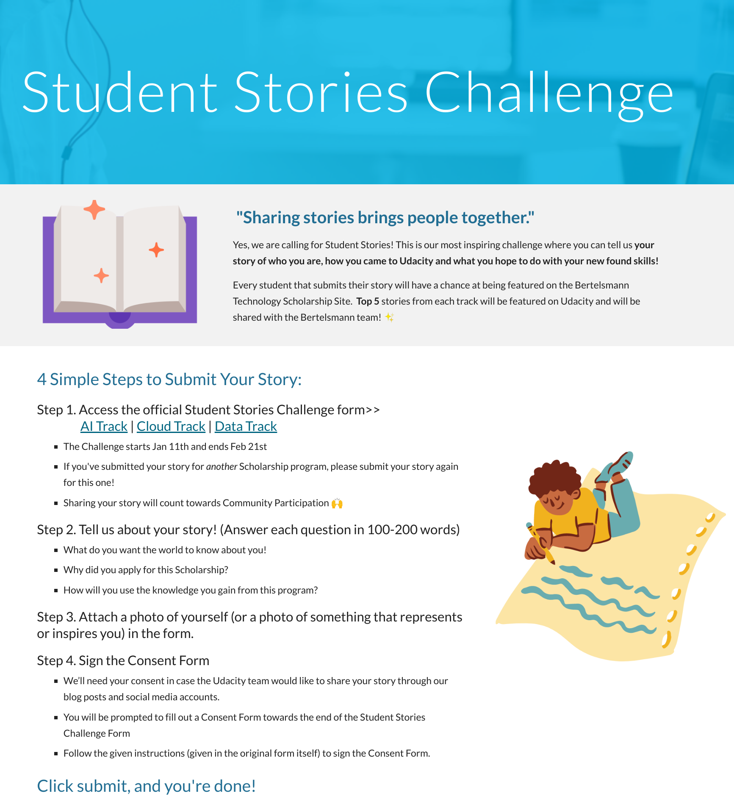

# D44: Friday, January 15, 2021.
- I'm reading the source code of "Lesson 5 - Project: Deploy an Article CMS to Azure".
- I talked to a friend giving her tips about how to pass to Phase 2.
- I encourage @Mateusz Zatylny, @Ana Peçini, @rachael bryce, @Laura_in_VA, @Ankit Biswas, @Kaustubha Shravan, @PK, @tapti sippy, @Alberto Pardo, @Anurag Shukla, @Carlota Pearl, @John V, @priyanka hiranandani, @sreenidhi iyengar, @Skovski, @Peter Ojo, @Camila Andrea González Williamson, @Sai Ganesh, @Sohit, @Rushikesh Thombre, @Danur Wijayanto, @Omar, @Martin Kramer, @Prnika Bakshi, @Manasvi Trivedi, @fame chailert, @Livinus Igbaji, @Maria Jose Davila B, @G, @Maaz Ali, @Katherine to continue in the #60DaysofUdacity challenge.

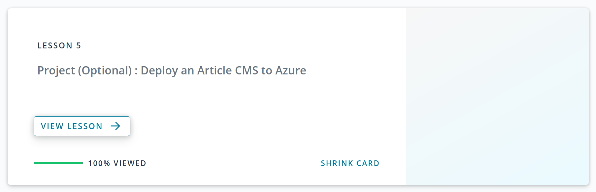

# D45: Saturday, January 16, 2021.
- I joined the study group #sg_python_for_everyone and we are planning a meeting called "Introduction to Python."
- I read the wikipedia article on Cloud Computing: https://en.wikipedia.org/wiki/Cloud_computing
- I encourage @Mateusz Zatylny, @Ana Peçini, @rachael bryce, @Laura_in_VA, @Ankit Biswas, @Kaustubha Shravan, @PK, @tapti sippy, @Alberto Pardo, @Anurag Shukla, @Carlota Pearl, @John V, @priyanka hiranandani, @sreenidhi iyengar, @Skovski, @Peter Ojo, @Camila Andrea González Williamson, @Sai Ganesh, @Sohit, @Rushikesh Thombre, @Danur Wijayanto, @Omar, @Martin Kramer, @Prnika Bakshi, @Manasvi Trivedi, @fame chailert, @Livinus Igbaji, @Maria Jose Davila B, @G, @Maaz Ali, @Katherine to continue in the #60DaysofUdacity challenge.

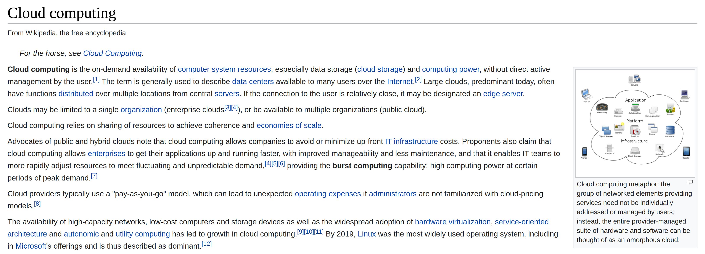

# D46: Sunday, January 17, 2021.
- I'm a Python demigod. But I still don't know Flask. So, I started to study this Flask tutorial: https://www.freecodecamp.org/news/learn-flask-for-python-full-tutorial/ 
- I encourage @Mateusz Zatylny, @Ana Peçini, @rachael bryce, @Laura_in_VA, @Ankit Biswas, @Kaustubha Shravan, @PK, @tapti sippy, @Alberto Pardo, @Anurag Shukla, @Carlota Pearl, @John V, @priyanka hiranandani, @sreenidhi iyengar, @Skovski, @Peter Ojo, @Camila Andrea González Williamson, @Sai Ganesh, @Sohit, @Rushikesh Thombre, @Danur Wijayanto, @Omar, @Martin Kramer, @Prnika Bakshi, @Manasvi Trivedi, @fame chailert, @Livinus Igbaji, @Maria Jose Davila B, @G, @Maaz Ali, @Katherine to continue in the #60DaysofUdacity challenge.

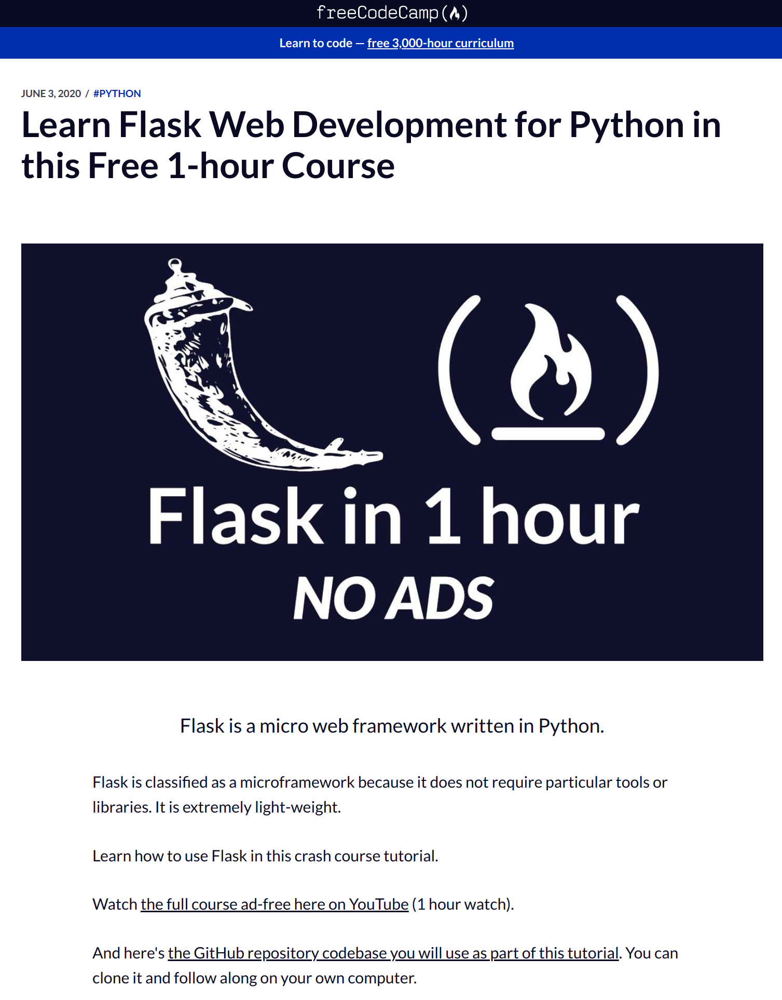

# D47: Monday, January 18, 2021.
- I submitted my entry to the Student Stories Challenge: https://sites.google.com/udacity.com/bertelsmann-tech-scholarship/community/student-stories-challenge
- I encourage @Mateusz Zatylny, @Ana Peçini, @rachael bryce, @Laura_in_VA, @Ankit Biswas, @Kaustubha Shravan, @PK, @tapti sippy, @Alberto Pardo, @Anurag Shukla, @Carlota Pearl, @John V, @priyanka hiranandani, @sreenidhi iyengar, @Skovski, @Peter Ojo, @Camila Andrea González Williamson, @Sai Ganesh, @Sohit, @Rushikesh Thombre, @Danur Wijayanto, @Omar, @Martin Kramer, @Prnika Bakshi, @Manasvi Trivedi, @fame chailert, @Livinus Igbaji, @Maria Jose Davila B, @G, @Maaz Ali, @Katherine to continue in the #60DaysofUdacity challenge.

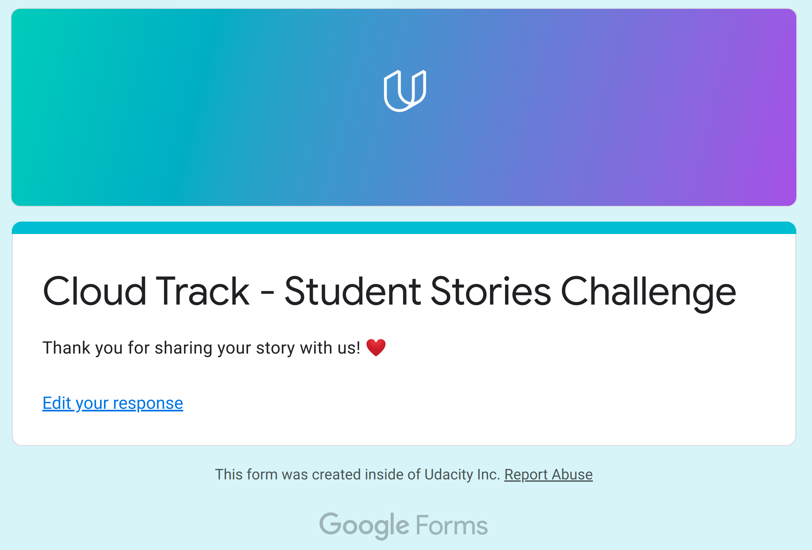
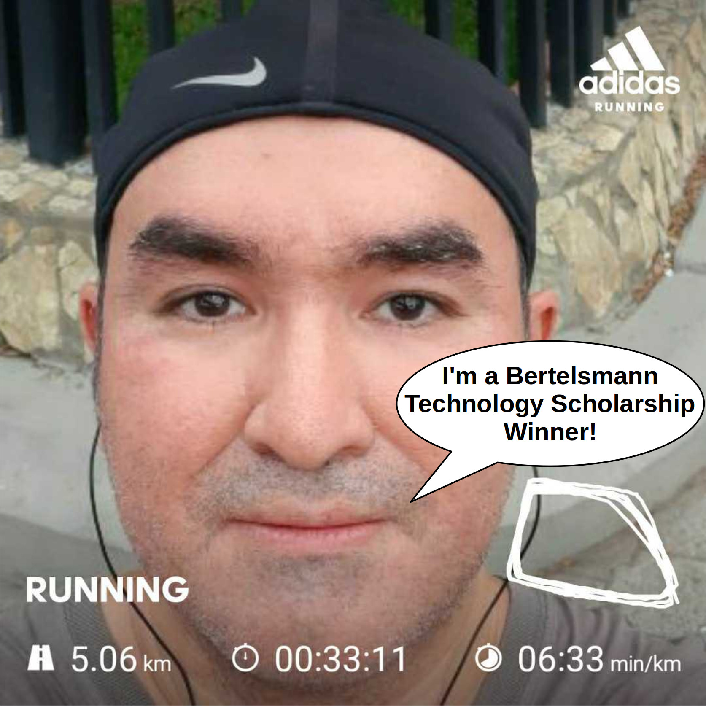
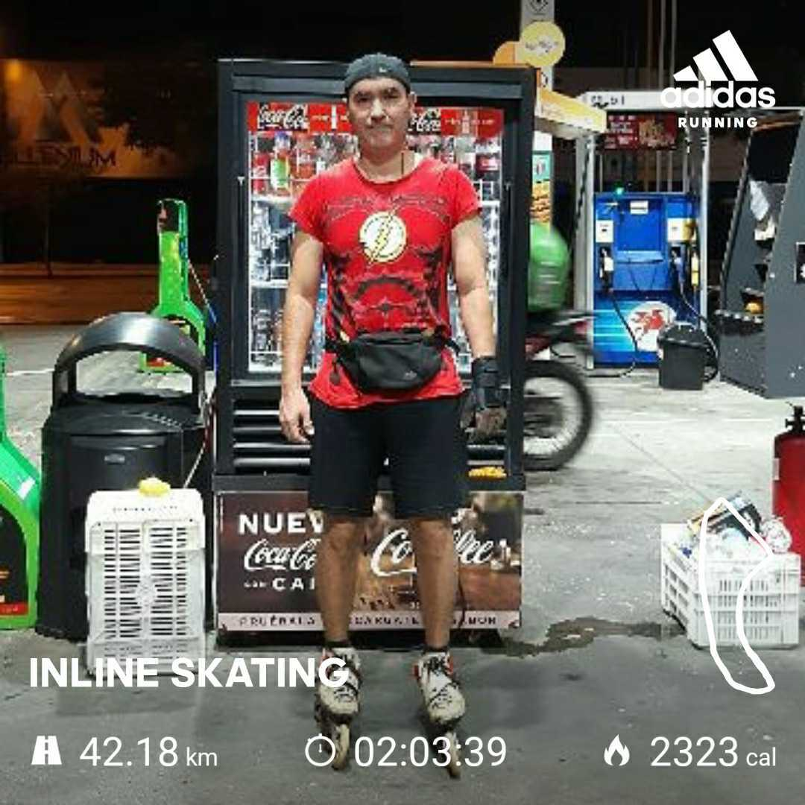

# D48: Tuesday, January 19, 2021.
- I continue to study this Flask tutorial: https://www.freecodecamp.org/news/learn-flask-for-python-full-tutorial/ 
- I encourage @Mateusz Zatylny, @Ana Peçini, @rachael bryce, @Laura_in_VA, @Ankit Biswas, @Kaustubha Shravan, @PK, @tapti sippy, @Alberto Pardo, @Anurag Shukla, @Carlota Pearl, @John V, @priyanka hiranandani, @sreenidhi iyengar, @Skovski, @Peter Ojo, @Camila Andrea González Williamson, @Sai Ganesh, @Sohit, @Rushikesh Thombre, @Danur Wijayanto, @Omar, @Martin Kramer, @Prnika Bakshi, @Manasvi Trivedi, @fame chailert, @Livinus Igbaji, @Maria Jose Davila B, @G, @Maaz Ali, @Katherine to continue in the #60DaysofUdacity challenge.

# D49: Wednesday, January 20, 2021.
- I was talking with Ekaterina about the webinar "Intro to Python" we will give for the Studay Jam 1.0. We were preparing the exercises.
- I encourage @Mateusz Zatylny, @Ana Peçini, @rachael bryce, @Laura_in_VA, @Ankit Biswas, @Kaustubha Shravan, @PK, @tapti sippy, @Alberto Pardo, @Anurag Shukla, @Carlota Pearl, @John V, @priyanka hiranandani, @sreenidhi iyengar, @Skovski, @Peter Ojo, @Camila Andrea González Williamson, @Sai Ganesh, @Sohit, @Rushikesh Thombre, @Danur Wijayanto, @Omar, @Martin Kramer, @Prnika Bakshi, @Manasvi Trivedi, @fame chailert, @Livinus Igbaji, @Maria Jose Davila B, @G, @Maaz Ali, @Katherine to continue in the #60DaysofUdacity challenge.

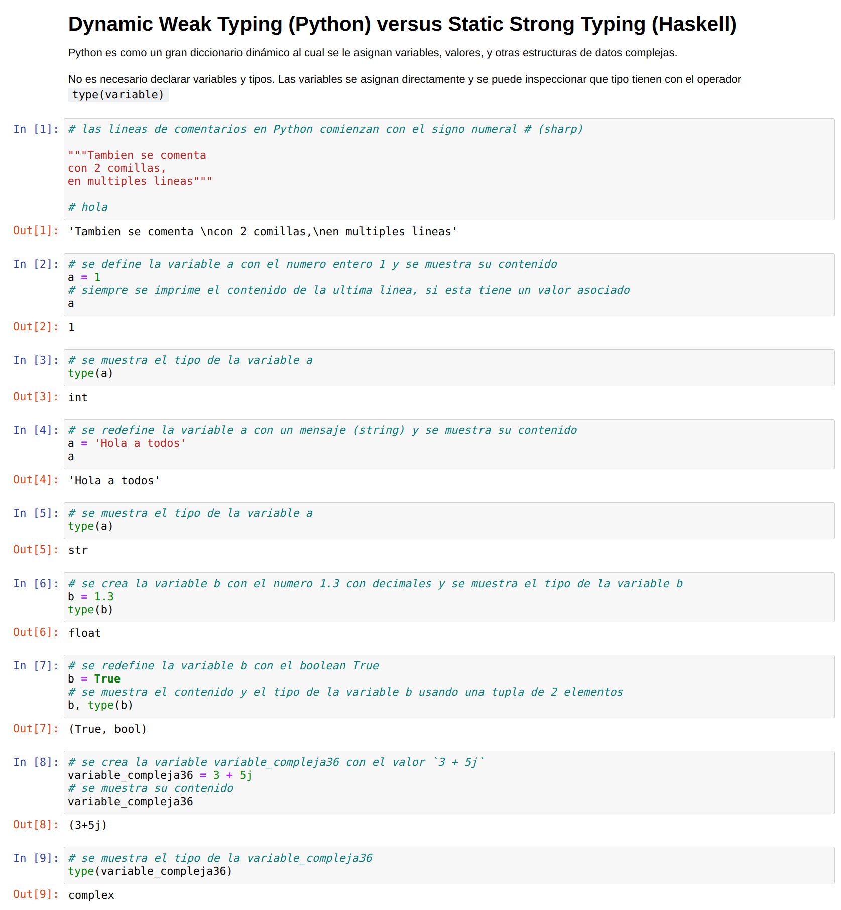

# D50: Thursday, January 21, 2021.
- I had a Zoom meeting with Ekaterina about the webinar "Intro to Python" we will give for the Studay Jam 1.0. We were discussing about the technical aspects of the meeting, i.e. the platform, the link, Jupyter notebooks.
- I encourage @Mateusz Zatylny, @Ana Peçini, @rachael bryce, @Laura_in_VA, @Ankit Biswas, @Kaustubha Shravan, @PK, @tapti sippy, @Alberto Pardo, @Anurag Shukla, @Carlota Pearl, @John V, @priyanka hiranandani, @sreenidhi iyengar, @Skovski, @Peter Ojo, @Camila Andrea González Williamson, @Sai Ganesh, @Sohit, @Rushikesh Thombre, @Danur Wijayanto, @Omar, @Martin Kramer, @Prnika Bakshi, @Manasvi Trivedi, @fame chailert, @Livinus Igbaji, @Maria Jose Davila B, @G, @Maaz Ali, @Katherine to continue in the #60DaysofUdacity challenge.

# D51: Friday, January 22, 2021.
- I continue talking to Ekaterina about the webinar "Intro to Python" we will give for the Studay Jam 1.0. 
- I encourage @Mateusz Zatylny, @Ana Peçini, @rachael bryce, @Laura_in_VA, @Ankit Biswas, @Kaustubha Shravan, @PK, @tapti sippy, @Alberto Pardo, @Anurag Shukla, @Carlota Pearl, @John V, @priyanka hiranandani, @sreenidhi iyengar, @Skovski, @Peter Ojo, @Camila Andrea González Williamson, @Sai Ganesh, @Sohit, @Rushikesh Thombre, @Danur Wijayanto, @Omar, @Martin Kramer, @Prnika Bakshi, @Manasvi Trivedi, @fame chailert, @Livinus Igbaji, @Maria Jose Davila B, @G, @Maaz Ali, @Katherine to continue in the #60DaysofUdacity challenge.

# D52: Saturday, January 23, 2021.
- I finished watching the video lecture of this Flask tutorial: https://www.freecodecamp.org/news/learn-flask-for-python-full-tutorial/ 
- I encourage @Mateusz Zatylny, @Ana Peçini, @rachael bryce, @Laura_in_VA, @Ankit Biswas, @Kaustubha Shravan, @PK, @tapti sippy, @Alberto Pardo, @Anurag Shukla, @Carlota Pearl, @John V, @priyanka hiranandani, @sreenidhi iyengar, @Skovski, @Peter Ojo, @Camila Andrea González Williamson, @Sai Ganesh, @Sohit, @Rushikesh Thombre, @Danur Wijayanto, @Omar, @Martin Kramer, @Prnika Bakshi, @Manasvi Trivedi, @fame chailert, @Livinus Igbaji, @Maria Jose Davila B, @G, @Maaz Ali, @Katherine to continue in the #60DaysofUdacity challenge.

# D53: Sunday, January 24, 2021.
- I'm learning Kubernetes with this tutorial: https://www.youtube.com/watch?v=F-p_7XaEC84
- I encourage @Mateusz Zatylny, @Ana Peçini, @rachael bryce, @Laura_in_VA, @Ankit Biswas, @Kaustubha Shravan, @PK, @tapti sippy, @Alberto Pardo, @Anurag Shukla, @Carlota Pearl, @John V, @priyanka hiranandani, @sreenidhi iyengar, @Skovski, @Peter Ojo, @Camila Andrea González Williamson, @Sai Ganesh, @Sohit, @Rushikesh Thombre, @Danur Wijayanto, @Omar, @Martin Kramer, @Prnika Bakshi, @Manasvi Trivedi, @fame chailert, @Livinus Igbaji, @Maria Jose Davila B, @G, @Maaz Ali, @Katherine to continue in the #60DaysofUdacity challenge.

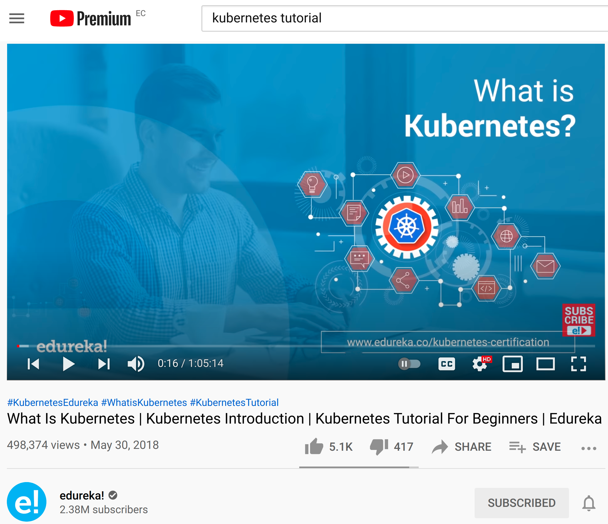

# D54: Monday, January 25, 2021.
- I watched this video: **React JS CI/CD with Azure Devops to Azure App Service** <https://youtu.be/aMO-NQ1Xza0>
- I encourage @Mateusz Zatylny, @Ana Peçini, @rachael bryce, @Laura_in_VA, @Ankit Biswas, @Kaustubha Shravan, @PK, @tapti sippy, @Alberto Pardo, @Anurag Shukla, @Carlota Pearl, @John V, @priyanka hiranandani, @sreenidhi iyengar, @Skovski, @Peter Ojo, @Camila Andrea González Williamson, @Sai Ganesh, @Sohit, @Rushikesh Thombre, @Danur Wijayanto, @Omar, @Martin Kramer, @Prnika Bakshi, @Manasvi Trivedi, @fame chailert, @Livinus Igbaji, @Maria Jose Davila B, @G, @Maaz Ali, @Katherine to continue in the #60DaysofUdacity challenge.

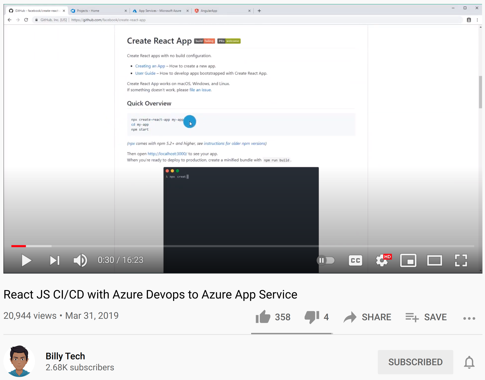

# D55: Tuesday, January 26, 2021.
- I worked extensively testing all the functionalities of Google Colab in order to prepare our presentation "Intro to Python" for the Study Jam 1.0: <https://colab.research.google.com/notebooks/intro.ipynb>
- I encourage @Mateusz Zatylny, @Ana Peçini, @rachael bryce, @Laura_in_VA, @Ankit Biswas, @Kaustubha Shravan, @PK, @tapti sippy, @Alberto Pardo, @Anurag Shukla, @Carlota Pearl, @John V, @priyanka hiranandani, @sreenidhi iyengar, @Skovski, @Peter Ojo, @Camila Andrea González Williamson, @Sai Ganesh, @Sohit, @Rushikesh Thombre, @Danur Wijayanto, @Omar, @Martin Kramer, @Prnika Bakshi, @Manasvi Trivedi, @fame chailert, @Livinus Igbaji, @Maria Jose Davila B, @G, @Maaz Ali, @Katherine to continue in the #60DaysofUdacity challenge.

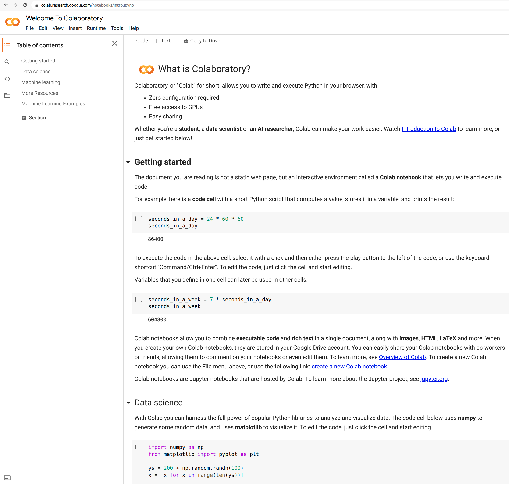

# D56: Wednesday, January 27, 2021.
- I read the messages in the channel #study_jam_volunteers.
- I noticed our webinar "Fun Facts and Intro to Python" appears in the *Schedule of Study Jam Activity*. We will give our webinar this Sunday, January 31, 2021 at 7:00-8:30 PST. (15:00 GMT)
- I encourage @Mateusz Zatylny, @Ana Peçini, @rachael bryce, @Laura_in_VA, @Ankit Biswas, @Kaustubha Shravan, @PK, @tapti sippy, @Alberto Pardo, @Anurag Shukla, @Carlota Pearl, @John V, @priyanka hiranandani, @sreenidhi iyengar, @Skovski, @Peter Ojo, @Camila Andrea González Williamson, @Sai Ganesh, @Sohit, @Rushikesh Thombre, @Danur Wijayanto, @Omar, @Martin Kramer, @Prnika Bakshi, @Manasvi Trivedi, @fame chailert, @Livinus Igbaji, @Maria Jose Davila B, @G, @Maaz Ali, @Katherine to continue in the #60DaysofUdacity challenge.

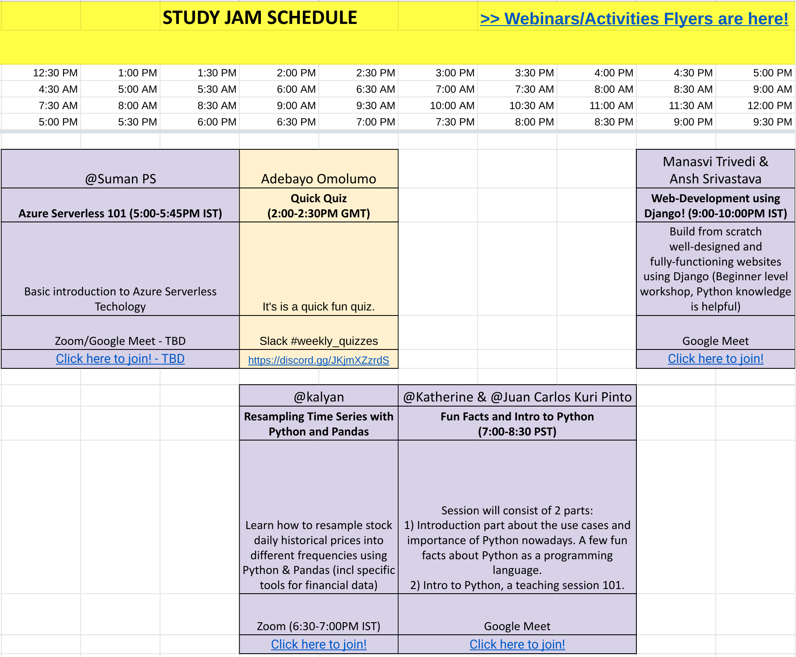

# D57: Thursday, January 28, 2021.
- I was preparing the programming exercises for our webinar "Fun Facts and Intro to Python" by using Google Colab.
- I encourage @Mateusz Zatylny, @Ana Peçini, @rachael bryce, @Laura_in_VA, @Ankit Biswas, @Kaustubha Shravan, @PK, @tapti sippy, @Alberto Pardo, @Anurag Shukla, @Carlota Pearl, @John V, @priyanka hiranandani, @sreenidhi iyengar, @Skovski, @Peter Ojo, @Camila Andrea González Williamson, @Sai Ganesh, @Sohit, @Rushikesh Thombre, @Danur Wijayanto, @Omar, @Martin Kramer, @Prnika Bakshi, @Manasvi Trivedi, @fame chailert, @Livinus Igbaji, @Maria Jose Davila B, @G, @Maaz Ali, @Katherine to continue in the #60DaysofUdacity challenge.

# D58: Friday, January 29, 2021.
- I just published the programming exercises for our webinar "Fun Facts and Intro to Python" by using Google Colab: http://bit.do/PythonForCloud
- I will continue documenting and improving the programming exercises.
- I encourage @Mateusz Zatylny, @Ana Peçini, @rachael bryce, @Laura_in_VA, @Ankit Biswas, @Kaustubha Shravan, @PK, @tapti sippy, @Alberto Pardo, @Anurag Shukla, @Carlota Pearl, @John V, @priyanka hiranandani, @sreenidhi iyengar, @Skovski, @Peter Ojo, @Camila Andrea González Williamson, @Sai Ganesh, @Sohit, @Rushikesh Thombre, @Danur Wijayanto, @Omar, @Martin Kramer, @Prnika Bakshi, @Manasvi Trivedi, @fame chailert, @Livinus Igbaji, @Maria Jose Davila B, @G, @Maaz Ali, @Katherine to continue in the #60DaysofUdacity challenge.

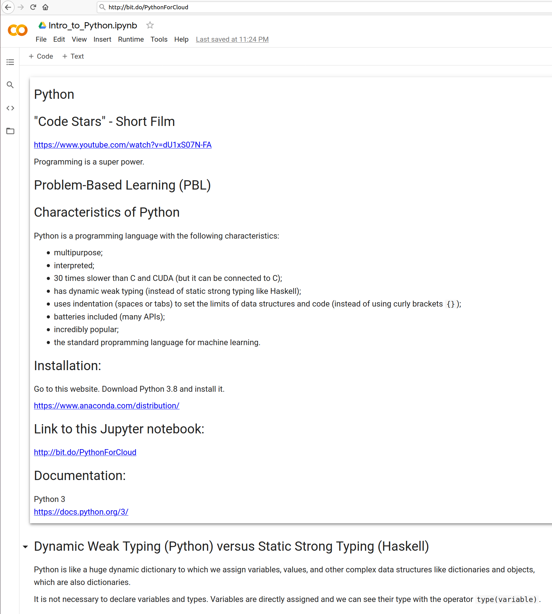

# D59: Saturday, January 30, 2021.
- I continue documenting and improving the programming exercises of our webinar "Fun Facts and Intro to Python" by using Google Colab:  http://bit.do/PythonForCloud
- We will give our webinar this Sunday, January 31, 2021 at 7:00-8:30 PST. (15:00 GMT)
- I encourage @Mateusz Zatylny, @Ana Peçini, @rachael bryce, @Laura_in_VA, @Ankit Biswas, @Kaustubha Shravan, @PK, @tapti sippy, @Alberto Pardo, @Anurag Shukla, @Carlota Pearl, @John V, @priyanka hiranandani, @sreenidhi iyengar, @Skovski, @Peter Ojo, @Camila Andrea González Williamson, @Sai Ganesh, @Sohit, @Rushikesh Thombre, @Danur Wijayanto, @Omar, @Martin Kramer, @Prnika Bakshi, @Manasvi Trivedi, @fame chailert, @Livinus Igbaji, @Maria Jose Davila B, @G, @Maaz Ali, @Katherine to continue in the #60DaysofUdacity challenge.

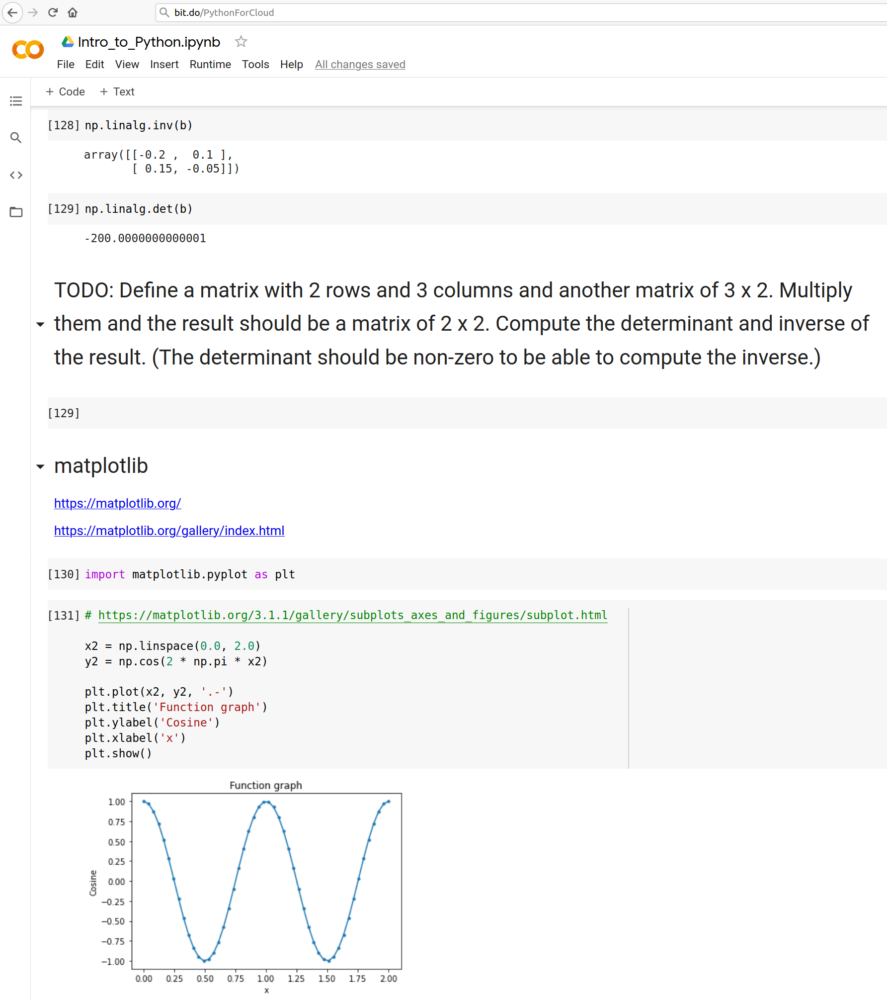

# D60: Sunday, January 31, 2021.
- Today, @Katherine and I gave our webinar "Fun Facts and Intro to Python" in the Study Jam 1.0. Here is the video recording of the webinar: https://youtu.be/2AUVHMWSnlo
- I encourage @Mateusz Zatylny, @Ana Peçini, @rachael bryce, @Laura_in_VA, @Ankit Biswas, @Kaustubha Shravan, @PK, @tapti sippy, @Alberto Pardo, @Anurag Shukla, @Carlota Pearl, @John V, @priyanka hiranandani, @sreenidhi iyengar, @Skovski, @Peter Ojo, @Camila Andrea González Williamson, @Sai Ganesh, @Sohit, @Rushikesh Thombre, @Danur Wijayanto, @Omar, @Martin Kramer, @Prnika Bakshi, @Manasvi Trivedi, @fame chailert, @Livinus Igbaji, @Maria Jose Davila B, @G, @Maaz Ali, @Katherine to continue in the #60DaysofUdacity challenge.

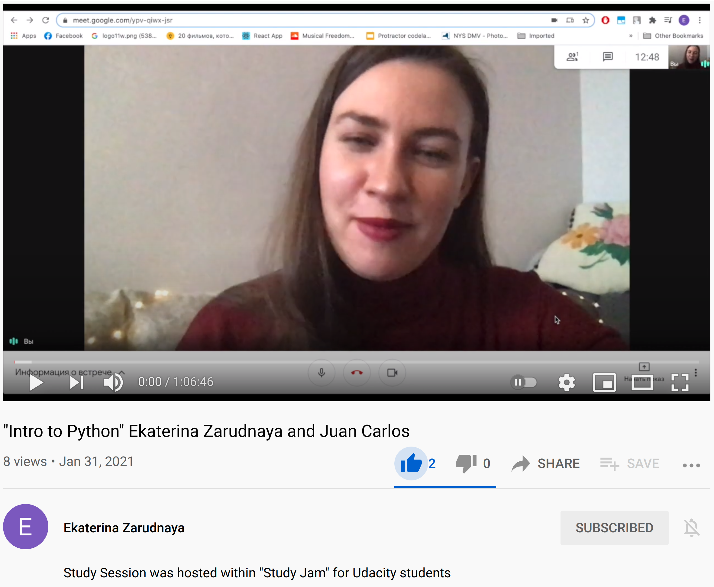

# D61: Monday, February 1, 2021.
- Going back to the final project of the course. This time I will focus to finish it.
- I encourage @Mateusz Zatylny, @Ana Peçini, @rachael bryce, @Laura_in_VA, @Ankit Biswas, @Kaustubha Shravan, @PK, @tapti sippy, @Alberto Pardo, @Anurag Shukla, @Carlota Pearl, @John V, @priyanka hiranandani, @sreenidhi iyengar, @Skovski, @Peter Ojo, @Camila Andrea González Williamson, @Sai Ganesh, @Sohit, @Rushikesh Thombre, @Danur Wijayanto, @Omar, @Martin Kramer, @Prnika Bakshi, @Manasvi Trivedi, @fame chailert, @Livinus Igbaji, @Maria Jose Davila B, @G, @Maaz Ali, @Katherine to continue in the #60DaysofUdacity challenge.

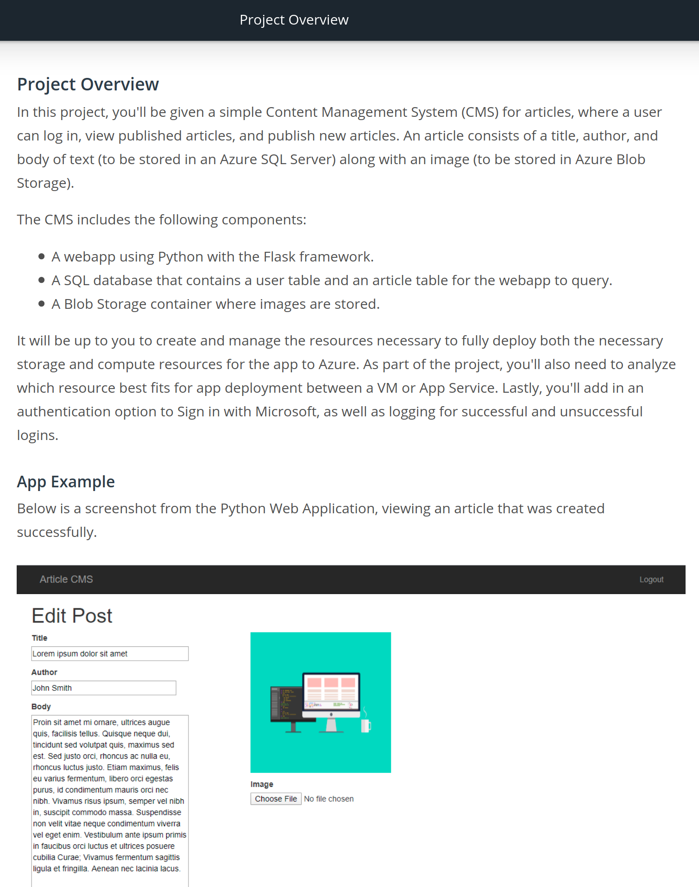

# D62: Tuesday, February 2, 2021.
- I read some of these Flask tutorials: https://flask.palletsprojects.com/en/1.1.x/tutorial/
- I encourage @Mateusz Zatylny, @Ana Peçini, @rachael bryce, @Laura_in_VA, @Ankit Biswas, @Kaustubha Shravan, @PK, @tapti sippy, @Alberto Pardo, @Anurag Shukla, @Carlota Pearl, @John V, @priyanka hiranandani, @sreenidhi iyengar, @Skovski, @Peter Ojo, @Camila Andrea González Williamson, @Sai Ganesh, @Sohit, @Rushikesh Thombre, @Danur Wijayanto, @Omar, @Martin Kramer, @Prnika Bakshi, @Manasvi Trivedi, @fame chailert, @Livinus Igbaji, @Maria Jose Davila B, @G, @Maaz Ali, @Katherine to continue in the #60DaysofUdacity challenge.

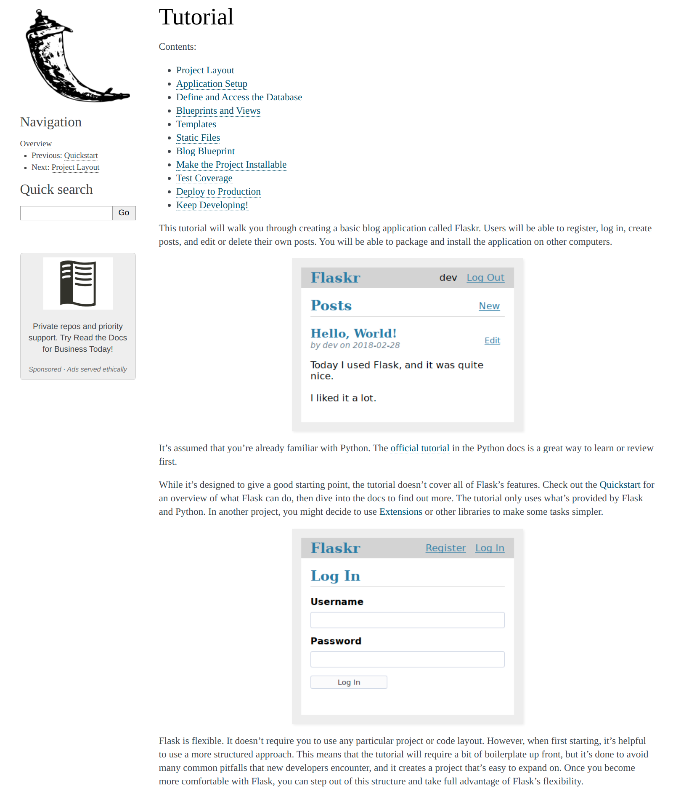

# D63: Wednesday, February 3, 2021.
